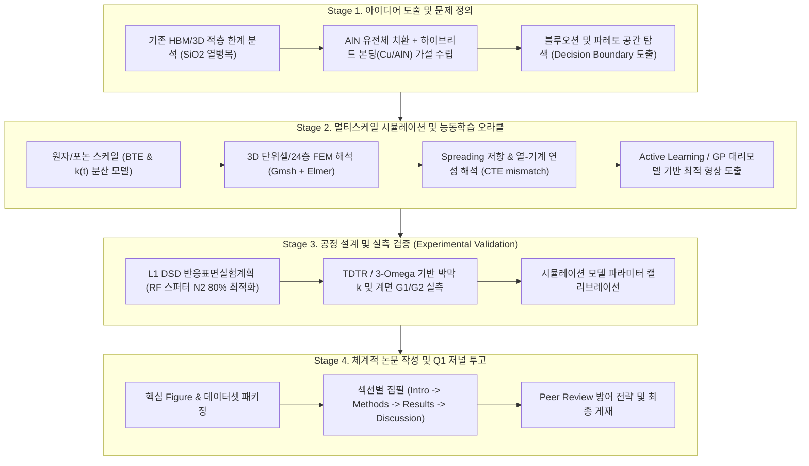

# 🔬 [종합 연구 마스터플랜] 아이디어 도출부터 Q1 논문 게재까지의 엔드투엔드(E2E) 프레임워크

> **문서 상태**: 실행 승인용 마스터 아키텍처 (Master Pipeline Design)  
> **핵심 주제**: 3D 칩렛·하이브리드 본딩을 위한 AlN 기반 나노 열관리 및 포논 수송 제어  
> **목표**: 아이디어 구체화 → 시뮬레이션 및 수치해석 오라클 → 실험/실측(TDTR) 보정 → Q1 저널 논문 완성 및 학술/산업 자산화

---

## 🗺️ 1. 전체 연구 생애주기 워크플로우 (End-to-End Pipeline)

---

## 📌 2. 단계별 핵심 과업 및 실행 가이드

### 📍 Stage 1. 아이디어 발굴 및 선별 (Idea Inception & Refinement)
1. **문제의 본질 규명 (Pain Point)**
   - 3D 칩렛 및 고대역폭 메모리(HBM)의 집적도가 증가함에 따라, 미세 Cu 패드 사이를 채우는 층간 절연막(SiO₂, $k \approx 1.3\,\text{W/m}\cdot\text{K}$)이 심각한 열적 장벽(Thermal Bottleneck)으로 작용.
   - 절연막을 고열전도성 질화알루미늄(AlN, 벌크 $k \approx 320\,\text{W/m}\cdot\text{K}$, 나노박막 유효 $k \approx 30\sim 80\,\text{W/m}\cdot\text{K}$)으로 대체하는 아이디어 구체화.
2. **반증 가능 가설(Falsifiable Hypothesis) 수립**
   - *가설 1*: "박막 두께가 나노스케일로 감소하더라도 경계 산란(Boundary Scattering)을 감안한 유효 열전도도가 SiO₂ 대비 20배 이상 유지될 것이다."
   - *가설 2*: "Cu 패드와 AlN 유전체 간의 열팽창계수(CTE) 및 계면 열저항(TBR) 차이로 인해, 특정 Cu 면적비(Pitch) 이하에서는 Spreading 저항에 의한 열류 역전 현상이 나타날 것이다."
3. **선행 문헌 및 차별화 분석 (Gap Analysis)**
   - 단순 물성 비교를 넘어선 **"실제 3D 하이브리드 본딩 기하구조 + 계면 결함 + Spreading 저항"**을 통합 고려한 포괄적 설계 지침을 도출하여 세계 최초성 확보.

---

### 📍 Stage 2. 모델링 & 다중물리 시뮬레이션 (Multiphysics Oracle)
1. **마이크로스케일 포논 전달(BTE) 수치 모델링**
   - 막 두께 $t$ 및 결정립 크기 $d_g$에 따른 포논 평균 자유 행로(MFP) 보정:
     $$\frac{1}{\Lambda_{\text{eff}}(\omega)} = \frac{1}{\Lambda_{\text{bulk}}(\omega)} + \frac{1}{t} + \frac{1}{d_g}$$
   - 두께 의존적 국소 열전도도 함수 $k(t)$ 정립.
2. **3D 단위셀 및 24-Die 적층 FEM 구축**
   - Gmsh 파라메트릭 스크립트 작성 (`create_3d_unitcell_geo.py`)
   - Cu Pad-유전체 이종 계면 비대칭 TBC($G_1, G_2$) 경계조건 적용.
   - 열확산 저항 보정 계수($\eta_{\text{constriction}}$) 추출.
3. **열-기계(Thermo-Mechanical) 연성 해석**
   - Si ($2.6\times 10^{-6}/\text{K}$), AlN ($4.5\times 10^{-6}/\text{K}$), Cu ($16.5\times 10^{-6}/\text{K}$) 열팽창 불일치에 따른 Von Mises 잔류응력 해석 및 계면 박리(Delamination) 지수 평가.
4. **Active Learning 기반 대리 모델링 (Surrogate Model)**
   - Gaussian Process(GP) + Expected Improvement(EI) 기반으로 최적 Cu 밀도, Pitch, AlN 두께 조합을 자율 탐색.

---

### 📍 Stage 3. 공정 최적화 및 실험 검증 (Fabrication & Characterization)
1. **L1 DSD (Definitive Screening Design) 실험 설계**
   - 질소 분압 비율($\text{N}_2 = 80\%$), RF Power, Substrate Temperature 최적화 (27개 조건군).
   - XRD FWHM 및 락킹 커브(Rocking Curve)를 통한 c축配向성((002) 피크) 극대화.
2. **TDTR (Time-Domain Thermoreflectance) 정밀 열특성 분석**
   - 시료 두께별($20, 50, 100, 200\,\text{nm}$) 면직 열전도도 $k_{\perp}$ 및 계면 열컨덕턴스($G_{\text{Si/AlN}}$, $G_{\text{AlN/Cu}}$) 측정.
3. **오라클 데이터 캘리브레이션**
   - 실측치를 시뮬레이션 모델 경계조건에 역반영하여 해석 오차 $5\%$ 이내로 신뢰도 확보.

---

### 📍 Stage 4. 논문 기획 및 집필 (Manuscript Production)
1. **Target Q1 저널 포트폴리오**
   - *Target A*: **IEEE Transactions on Electron Devices (TED)** (반도체/디바이스 소자 관점)
   - *Target B*: **Applied Thermal Engineering (ATE)** (열관리/엔지니어링 시스템 관점)
   - *Target C*: **International Journal of Heat and Mass Transfer (IJHMT)** (나노 열전달/포논 메커니즘 관점)
   - *Target D*: **ACS Applied Electronic Materials** (재료/계면 공학 관점)
2. **스토리라인 뼈대 (Narrative Architecture)**
   - **제목(안)**: *Breakdown of Continuum Assumption and Spreading Resistance Inversion in 3D-Stacked Hybrid Bonding: When Does AlN Outperform SiO₂?*
   - **핵심 질문**: "어떤 공정 및 기하학적 조건(Boundary)에서 AlN이 SiO₂ 대비 확실한 공학적 실익을 가지는가?"
3. **완전한 구조화 집필**:
   - `01_연구_아이디어_선정_및_가설설계.md`
   - `02_멀티스케일_시뮬레이션_및_해석엔진_설계.md`
   - `03_실험계획_및_실측_검증_프로토콜.md`
   - `04_Q1_저널_투고용_논문_작성_마스터가이드.md`
   - `05_연구_로드맵_및_마일스톤_실행계획.md`

---

## 🔗 연계 모듈 및 상세 가이드 목록

- [[01_연구_아이디어_선정_및_가설설계]] : 독창적 아이디어 구체화, 블루/레드오션 차별화 매트릭스, 반증 가설 정립
- [[02_멀티스케일_시뮬레이션_및_해석엔진_설계]] : BTE, 3D FEM, 열-기계 연성 해석, 능동 학습 파이프라인
- [[03_실험계획_및_실측_검증_프로토콜]] : 스퍼터 증착 조건 최적화(L1 DSD), TDTR/3-omega 측정 및 데이터 피팅
- [[04_Q1_저널_투고용_논문_작성_마스터가이드]] : 논문 구조, 주요 Figure 기획, 핵심 문맥 작성법, 리뷰어 방어 전략
- [[05_연구_로드맵_및_마일스톤_실행계획]] : 주차별/월별 실행 마일스톤, 위험 관리 및 자원 배분 계획
- **부모 지식 연결**: [[환영합니다!]], [[Reserach1_향후_연구개발_계획서]], [[Final_Master_Plan_2027-2028]], [[00_MASTER_SUMMARY]]

## 🔗 지식 연결 (Knowledge Mesh)
- **Parent Hub**: [[00_AlN_Research_Hub_Master_Index]]
- **Related Master Plan**: [[통합_연구_마스터플랜_멀티스케일_반도체_열관리]]
- **Master Index**: [[Index]]
