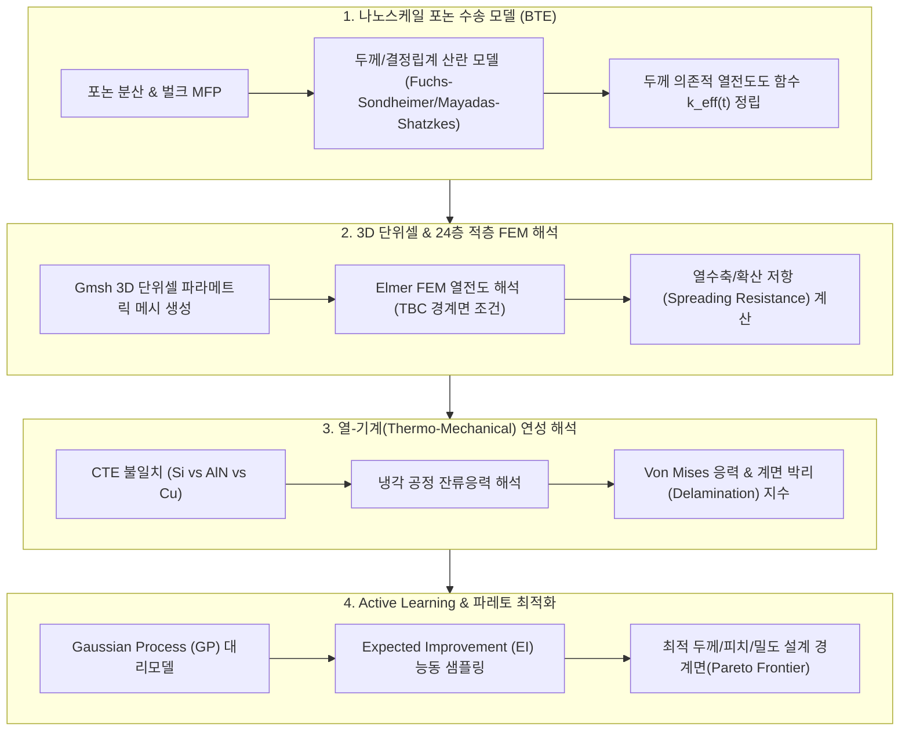

# ⚙️ [Module 2] 멀티스케일 시뮬레이션 및 해석 엔진 설계 가이드

> **소속 마스터플랜**: [00_아이디어_논문작성_통합_설계_마스터플랜.md](file:///d:/PS/00_아이디어_논문작성_통합_설계_마스터플랜.md)  
> **핵심 목적**: 포논 수송 모델(BTE)부터 3D 단위셀 FEM, Spreading 저항, 열-기계 연성 해석 및 능동 학습 오라클 구축

---

## 🏗️ 1. 멀티스케일 시뮬레이션 아키텍처

---

## 🔬 2. 핵심 물리 모델 수식화

### 2.1 포논 볼츠만 수송 방정식 (BTE) 기반 유효 열전도도
나노스케일 AlN 박막에서는 음향 포논(Acoustic Phonon)의 평균 자유 행로가 박막 두께 $t$ 및 결정립 크기 $d_g$에 의해 제한됩니다:
$$\frac{1}{\Lambda_{\text{eff}}(\omega)} = \frac{1}{\Lambda_{\text{bulk}}(\omega)} + \frac{1}{t\cdot \Phi(p)} + \frac{1}{d_g\cdot \Psi(R)}$$
- $p$: 계면 반사 사양(Specularity parameter, $0 \le p \le 1$)
- $R$: 결정립계 반사율(Grain boundary reflectivity)

이에 따른 두께 의존적 국소 열전도도는 다음과 같이 수치 적분하여 도출합니다:
$$k_{\text{eff}}(t) = \frac{1}{3} \int_0^{\omega_{\max}} C_v(\omega) v_g(\omega) \Lambda_{\text{eff}}(\omega, t)\, d\omega$$

### 2.2 3D 단위셀 열저항 및 Spreading 저항 분리
단위셀의 전체 열저항 $R_{\text{total}}''$은 1D 직렬 모델뿐만 아니라 3D 열선 집중에 의한 수축/확산 저항 $R_{\text{spread}}''$을 명시적으로 포함합니다:
$$R_{\text{total}}'' = R_{\text{1D}}'' + R_{\text{spread}}''$$
$$R_{\text{1D}}'' = \left( \frac{A_{\text{Cu}}}{A_{\text{cell}}} \frac{k_{\text{Cu}}}{t} + \frac{A_{\text{diel}}}{A_{\text{cell}}} \frac{k_{\text{diel}}}{t} \right)^{-1} + \frac{1}{G_{\text{equiv}}}$$
$$R_{\text{spread}}'' = f(\text{Pitch}, D_{\text{pad}}, k_{\text{diel}}, k_{\text{Cu}}, k_{\text{Si}})$$
- FEM 해석 결과와 1D 모델의 차이를 역산하여 $\eta_{\text{constriction}} = \frac{R_{\text{FEM}}''}{R_{\text{1D}}''}$ 곡선을 피팅합니다.

### 2.3 열응력(Thermo-Mechanical Stress) 모델
본딩 온도($T_{\text{bond}} = 250^\circ\text{C}$)에서 상온($T_0 = 25^\circ\text{C}$)으로 냉각 시, CTE 불일치에 의해 발생하는 열변형률:
$$\varepsilon_{\text{thermal}} = \Delta \alpha \cdot \Delta T = (\alpha_i - \alpha_{\text{substrate}}) \cdot (T_0 - T_{\text{bond}})$$
탄성-소성 계면 전단응력 $\tau_{\text{interface}}$ 및 Von Mises 유효응력 $\sigma_{\text{vM}}$:
$$\sigma_{\text{vM}} = \sqrt{\frac{1}{2}\left( (\sigma_1-\sigma_2)^2 + (\sigma_2-\sigma_3)^2 + (\sigma_3-\sigma_1)^2 \right)}$$

---

## 💻 3. 시뮬레이션 파이프라인 구현 계획 (Scripts)

| 스크립트 명 | 역할 및 기능 | 입력 파라미터 | 산출물 |
| :--- | :--- | :--- | :--- |
| `simulate_aln_phonon_bte.py` | BTE 기반 AlN 두께별 $k_{\text{eff}}(t)$ 계산 | $t \in [10, 500]\,\text{nm}$, $d_g$, $T$ | `k_vs_thickness.csv`, 포논 분산 곡선 |
| `create_3d_unitcell_geo.py` | Gmsh 파라메트릭 3D 단위셀 메시 생성 | Pitch, Pad Dia, Diel Thickness | `.msh` 3D 격자 파일 |
| `run_elmer_thermal_fem.py` | Elmer Solver 연동 3D 정상상태 열전도 해석 | 단위셀 격자, $G_1, G_2$, 열유속 | 3D 온도장, 열유속, $R_{\text{total}}''$ |
| `run_thermo_mechanical.py` | 열응력 및 Von Mises 분포 계산 | 온도 분포 결과, CTE, 탄성계수 $E$ | 잔류응력 맵, 박리 위험 지수 |
| `run_bayesian_optimization.py` | Active Learning 기반 최적 형상 자동 탐색 | 형상 설계 공간, 제약조건 | 파레토 프론티어, 최적 조건 파라미터 |

---

## 📈 4. 수렴성 및 품질 검증 기준 (Verification Gates)

1. **메시 독립성 검증 (Mesh Independence)**:
   - 계면 영역 격자 크기를 $1/2, 1/4$로 세분화하였을 때 최고 온도 $T_{\max}$ 변화율 $\le 0.5\%$.
2. **열수지 보존율 (Energy Conservation)**:
   - 상단 유입 열량($\iint q_{\text{in}}\,dA$)과 하단 방출 열량($\iint q_{\text{out}}\,dA$) 간의 오차 $\le 0.1\%$.
3. **1D 해석과의 점근적 일치성 (Asymptotic Consistency)**:
   - Cu 면적비가 $0\%$이거나 $100\%$인 극한 조건에서 이론적 1D 푸리에 열전도 해석값과 완벽히 일치함을 확인.

## 🔗 지식 연결 (Knowledge Graph)
- **Parent**: [[00_아이디어_논문작성_통합_설계_마스터플랜]]
- **Related**: [[GMSH_ELMER_AND_HYBRID_BONDING_THERMAL_REPORT]], [[SEAMLESS_SIMULATION_CHAIN_PLAN]], [[열확산 저항 (Spreading Resistance)]]

