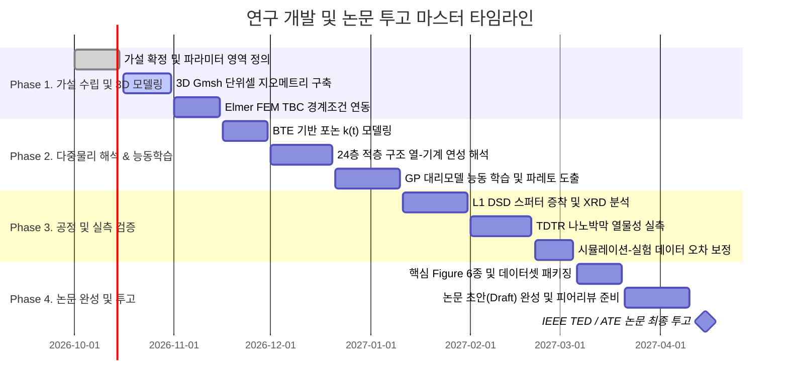

# 📅 [Module 5] 연구 로드맵, 마일스톤 및 자원 관리 계획

> **소속 마스터플랜**: [00_아이디어_논문작성_통합_설계_마스터플랜.md](file:///d:/PS/00_아이디어_논문작성_통합_설계_마스터플랜.md)  
> **핵심 목적**: 타임라인별 구체적 마일스톤 관리, 컴퓨팅/실험 자원 배분 및 리스크 대응 방안

---

## ⏱️ 1. 단계별 실행 타임라인 (Gantt-Style Roadmap)

---

## 💻 2. 컴퓨팅 및 하드웨어 자원 배분 전략

| 작업 구분 | 권장 하드웨어 환경 | 역할 및 세부 실행 작업 | 예상 소요 시간 |
| :--- | :--- | :--- | :--- |
| **단위 개발 & 선별** | 로컬 PC (Intel i5, GTX 1650 Ti, 32GB RAM) | - 파라메트릭 코드 작성 및 디버깅 - 1D 등가 저항망 신속 스윕 - Git 커밋 및 Markdown 문서화 | 실시간 (< 수분) |
| **대규모 3D FEM** | HPC 워크스테이션 / GPU 가속 노드 | - 24층 고밀도 3D 비균일 메시 해석 - 비선형 열-기계 연성 대변형 해석 | Run 당 20~40분 |
| **Active Learning** | 멀티코어 연산 노드 | - GP 하이퍼파라미터 최적화 - 다차원 설계 공간 몬테카를로 샘플링 | 수 시간 |
| **실험 장비 활용** | 공동기기원 (NNFC / KANC / 대학 센터) | - 마그네트론 스퍼터링 증착 - 고분해능 XRD, AFM 조도 측정 - TDTR 펨토초 레이저 측정 | 일정 예약 기반 |

---

## ⚠️ 3. 리스크 분석 및 비상 대응 전략 (Contingency Plans)

| 발생 가능한 리스크 | 영향도 | 사전 예방 및 비상 대응 방안 (Fallback Action) |
| :--- | :---: | :--- |
| **TDTR 측정 일정 지연 또는 장비 예약 불가** | **중** | 3-Omega 측정법을 로컬 환경에서 우선 적용하거나, 문헌의 최신 분광 데이터베이스(FDTR 선행 연구)를 기반으로 신뢰구간 민감도 분석 선행 |
| **AlN 박막의 고응력에 의한 크랙/박리** | **고** | 스퍼터링 공정 시 기판 바이어스 및 질소 분압을 미세 조정하고, $\text{SiO}_2$ 버퍼층 삽입 시나리오를 FEM 모델에 사전 반영 |
| **3D FEM 계산 수렴성 저하** | **중** | 접합 계면의 요소 종횡비(Aspect Ratio)를 제어하는 Gmsh Boundary Layer 메시 리파인먼트 적용 |
| **피어 리뷰어의 신규성 반박** | **중** | 단순 온도 감소량이 아닌, 'Spreading Resistance Inversion 곡선'과 '공정 신뢰성 파레토 경계'라는 새로운 물리적 메커니즘을 강조 |

## 🔗 지식 연결 (Knowledge Graph)
- **Parent**: [[00_아이디어_논문작성_통합_설계_마스터플랜]]
- **Related**: [[Final_Master_Plan_2027-2028]], [[00_MASTER_SUMMARY]], [[05_Multi-Institution_and_Startup_Path]]

