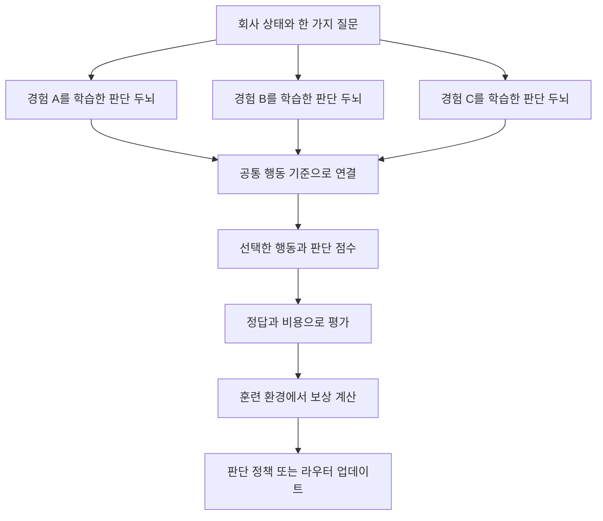

**Connect AI v3 공동 연구**는 인간의 의사결정과 자연의 집단 행동을 공부하고, 각자의 경험을 담은 작은 판단 모델을 연결해 검증하는 4주 프로그램입니다. 첫 목표는 기업의 한 가지 의사결정 과제를 정해, 단일 모델과 연결 모델의 결과를 재현 가능한 기록으로 비교하는 것입니다.

> **Independent brains. Connected intelligence.**
>
> Building AI we can own, run, and connect—on our own terms.

## 연구자 선언

우리는 인공지능 두뇌를 연구하고 개발하는 사람이다. CONNECT AI를 연구한다.

작은 개인의 개성이 담긴 인공지능들이 서로 연결하고 모였을 때, 빅테크가 만든 큰 인공지능 두뇌와 비슷하거나 더 강력한 결과를 낸다는 가설이다.

이 과정에서 우리는 인간의 두뇌와 세상의 현상을 공부하며 그것을 인공지능 두뇌로 개발한다.

두뇌 뉴런들의 연결, 각 요소들의 연결, 개미들의 사회성, 꿀벌의 집단 의사결정, 동물들의 집단 사회, 새 떼의 움직임, 점균의 연결망을 공부한다.

이것을 공부하며 우리는 인공지능의 지식뿐만 아니라 삶을 이해하고 더 깊이 생각하게 될 것이다. 공부하며 얻은 지식 중 나의 삶에 적용할 것이 있다면 긍정적으로 적용한다.

단지 인공지능의 연구, 비즈니스화뿐만 아니라 한 번뿐인 나의 삶을 더 멋지게 살아갈 수 있도록 최선을 다한다.

가장 중요한 것은 나를 스스로 믿는 것이다. 내가 앞으로 가는 방향을 믿고 포기하지 않는다. 내가 잘못되었고 남들보다 뒤떨어진다고 생각하지 않는다.

세상, 두뇌, 인간의 삶은 정답이 없고 다양함만이 있을 뿐이며, 잘못된 것 또한 없다. 다양함이 모였을 때 더 성장하고 앞으로 나아간다.

이 선언은 자발적으로 선택하는 공동 연구의 약속이며 법적 계약이 아닙니다.

## 연구의 목표와 검증할 가설

장기 비전은 개인과 작은 기업이 자신의 판단 기준을 이해하고, 직접 운영할 수 있는 AI를 갖는 것입니다. Connect AI의 흐름은 **v1 로컬 AI 프로그램 → v2 연결 연구 Lab → v3 C1과 의사결정 모델 공동 연구**로 이어집니다.

이번에는 ‘CEO 역할의 두뇌’ 중 한 기능을 좁혀 시작합니다. 예를 들어 고객 문의를 읽고 **즉시 처리, 일반 처리, 결제 담당 배정, 사람 확인** 중 다음 행동을 고르는 일입니다. 답변 작성이나 실제 결제 실행은 별도 기능으로 둡니다.

**이번 연구에서 검증할 세 가지 질문**

1. **연결 효과:** 같은 회사 규칙과 같은 시험 문제를 사용할 때, 서로 다른 사례와 관점을 학습한 소형 모델 3개의 연결이 검증 데이터에서 선택한 가장 좋은 단일 소형 모델보다 판단을 개선하는가?
2. **강화학습 효과:** 보상으로 실제 업데이트한 판단 정책 또는 연결 라우터가 업데이트 전 정책보다 성능과 비용의 균형을 개선하는가? 무엇을 학습했는지 구분해 보고한다.
3. **큰 모델과의 비교:** 지정한 기업 의사결정 과제에서, 연결된 소형 모델이 선택한 대형 모델의 품질에 얼마나 가까워지는가? 같은 입력 조건과 명시한 추론 예산에서 비교하고, 지연과 비용도 함께 기록한다.

**성공 기준 제안:** 최종 시험 전에 주 지표와 허용할 비용을 정합니다. 정확도만 높고 지연이나 위험한 오판이 커진 경우도 그대로 보고합니다. 대형 모델을 실제로 비교하지 못했다면 세 번째 질문은 미검증으로 남깁니다. 특정 과제에서의 결과를 모든 분야의 지능 우위로 확대하지 않습니다.

다양성은 모델 이름이나 연구자 수로 측정하지 않습니다. **서로 다른 문제를 잘 푸는지, 함께 틀리는 비율이 얼마나 되는지**로 확인합니다. 각자의 경험은 입력 사례와 검토 방식에 반영하되, 팀의 목표와 정답 기준은 공유합니다. 서로 모순되는 회사 규정을 단순히 다수결로 섞지 않습니다.

> [!CALLOUT] 🔬
>
> **영감과 증거를 구분합니다.** 뇌와 자연의 연구는 설계 아이디어를 줍니다. 그것만으로 ‘작은 AI를 연결하면 빅테크 모델을 이긴다’는 결론이 증명되지는 않습니다. 그 연결 고리를 우리 실험이 확인합니다.

## 4주 일정과 논문 제출 목표

**일정 제안은 2026년 10월 5일 시작을 기준으로 합니다.** 시작일이 달라지면 내부 활동 날짜를 조정합니다. 제출 목표는 **AAMAS 2027 Blue Sky Ideas**이며, **11월 3일 초록과 11월 10일 논문**을 내부 마감으로 유지합니다.

| 주차와 기간 | 함께 공부할 것 | 실행할 일 | 주말까지 남길 결과 |
| --- | --- | --- | --- |
| 1주차 10월 5일–11일 | 전전두엽과 판단 회로를 개미·꿀벌·집단 행동과 함께 공부 | 하루 하나의 연결 아이디어와 반례를 댓글로 기록 | 학습 댓글 5개와 연구 질문 1개 |
| 2주차 10월 12일–18일 | JEV형 판단, 강화학습, 확률 보정, 모델 연결 이론 | 행동·보상·비교 조건을 설계하고 공동 검토 | 실험 계획 1장과 고정할 평가 규칙 |
| 3주차 10월 19일–25일 | 설계한 원리를 실제 코드와 모델로 확인 | 데이터 분할, 두뇌 제작, 보상 학습, 연결 실험 | 실행 가능한 실험과 모델·코드·로그 |
| 4주차 10월 26일–11월 1일 | 결과의 의미와 한계, 재현성 | 연구원 결과 취합, 고정 시험, 그림 작성, 논문 초안 | 공동 결과표와 초록·본문 초안 |

**제출까지 이어지는 일정**

- **10월 18일:** 연구 질문, 주 지표, 데이터 분할 규칙, 보상과 비교 예산을 합의합니다.
- **10월 25일:** 검증 데이터로 선택한 모델·연결 방식·보류 기준을 고정합니다.
- **10월 26일–29일:** 연구원 결과를 취합하고, 고정된 설정으로 최종 시험을 실행합니다.
- **10월 30일–11월 1일:** 결과 그림, 한계, 초록 초안과 논문 본문 초안을 작성합니다.
- **11월 2일:** 초록의 숫자, 주장, 저자와 제출 규정을 확인합니다.
- **11월 3일:** 초록 제출 목표일입니다.
- **11월 4일–8일:** 본문의 관련 연구, 방법, 결과 해석과 재현 자료를 다듬습니다.
- **11월 9일:** 분량, 양식, 참고문헌과 그림을 최종 확인합니다.
- **11월 10일:** 전체 논문 제출 목표일입니다.

4주차의 목표는 결과를 모아 논문을 쓰는 것입니다. 게재나 심사 통과를 미리 약속하지 않습니다.

### AAMAS 2027 Blue Sky Ideas 일정

| 제출물 | 우리의 내부 마감 | 공식 마감 AoE UTC−12 | 한국 시간으로 환산한 공식 마감 |
| --- | --- | --- | --- |
| 초록 | 2026년 11월 3일 | 2026년 11월 5일 23:59:59 | 2026년 11월 6일 20:59:59 |
| 논문 | 2026년 11월 10일 | 2026년 11월 12일 23:59:59 | 2026년 11월 13일 20:59:59 |

공식 개최지는 **베트남 하노이**이며 학회는 2027년 5월 3일–7일입니다. 워릭 대학 웹사이트에서 안내한다고 해서 워릭에서 개최하는 것은 아닙니다. [AAMAS 공식 일정](https://warwick.ac.uk/fac/sci/dcs/aamas2027/)

Blue Sky는 새로운 비전과 연구 방향을 제안하는 트랙입니다. **본문 4쪽과 별도 참고문헌**, 이중 익명 심사입니다. 논문 제출 때 **Rationale for Blue Sky**와 의장만 보는 **Author Track Record**를 함께 준비합니다. 공식 공지의 **OpenReview 저자 등록 10월 20일**을 사전 점검 일정에 넣고 실제 등록 창을 확인합니다. [Blue Sky 공식 공고](https://warwick.ac.uk/fac/sci/dcs/aamas2027/calls/call-for-blue-sky-ideas/)

영문 LaTeX로 제출하며, 초록은 약 100–300단어입니다. AI로 가설이나 실험 방법을 설계했다면 도구·버전·프롬프트를 기록합니다. 생성형 이미지는 논문의 장식으로 사용하지 않습니다. [제출 지침과 AI 사용 정책](https://warwick.ac.uk/fac/sci/dcs/aamas2027/guidelines-and-policies/instructions/)


## 1주차 두뇌와 세상을 함께 공부하기

**질문은 하나입니다. ‘작은 요소들은 어떤 연결 규칙을 통해 더 좋은 판단을 만드는가?’** 매일 뇌의 원리와 세상의 현상을 한 쌍으로 읽고, AI 실험으로 옮길 아이디어를 남깁니다.

하루 **30–45분을 제안**합니다. 처음에는 원문 전체보다 초록과 그림 한 장을 읽습니다. 아래 설명으로 방향을 잡고, 연결된 원문에서 근거를 확인합니다. 영어 자료는 번역 도구를 써도 좋지만 핵심 주장과 한계는 원문과 대조합니다.

### 우리가 사용할 두뇌 비유

전전두엽은 계획과 우선순위 설정, 판단에 관여합니다. 실제 의사결정에는 전전두엽뿐 아니라 기저핵과 여러 피질·피질하 영역이 함께 관여합니다. **전전두엽을 ‘빠른 의사결정 전용 센터’로 부르지는 않습니다.** JEV의 System One이라는 설계 명칭도 특정 뇌 부위와 일대일로 대응하지 않습니다. 우리의 과제는 빠른 판단과 정확성의 균형을 배우고 모델로 시험하는 것입니다. [NIMH 전전두엽 설명](https://www.nimh.nih.gov/health/publications/the-teen-brain-7-things-to-know), [NIMH 의사결정 회로 설명](https://www.nimh.nih.gov/research/research-conducted-at-nimh/principal-investigators/silvia-lopez-guzman-md-phd)


*Connect AI 교육 개념도입니다. 대표적인 관여 영역을 강조한 그림이며 실제 활성 측정 영상이나 기능별 독점 구역을 뜻하지 않습니다.*

### 1일차 뉴런의 연결과 개미의 역할 분담

**뇌에서 읽기:** 뉴런은 시냅스를 통해 신호를 전달하고, 신경망을 통해 뇌의 여러 부분이 협력합니다. [NIH 신경계와 뉴런 안내](https://www.nichd.nih.gov/health/topics/neuro/conditioninfo/parts)

**세상에서 읽기:** Davidson 등은 수확개미의 접촉과 먹이 탐색 출발을 관찰하고, 개체가 접촉 신호를 누적하는 결정 모형을 제안했습니다. 연구한 종의 상황을 모든 개미의 규칙으로 일반화하지 않습니다. [Davidson 등 2016 원문](https://pmc.ncbi.nlm.nih.gov/articles/PMC5531068/)

**함께 묻기:** 각 두뇌는 전체 상황을 모두 알아야 할까요? 필요한 신호만 공유하면 어떤 이점과 누락이 생길까요?

**댓글 과제:** 회사 업무 1개를 골라 ‘각 두뇌가 알아야 할 정보 3개’와 ‘주고받을 신호 1개’를 적습니다. 예: 결제 두뇌는 결제 상태를, 긴급도 두뇌는 시작 시점을 확인한다. 이는 우리가 제안하는 설계 비유입니다.

**삶에 적용할 작은 실천:** 혼자 모든 일을 해결하려 하기보다, 이번 주 도움을 요청할 일 하나를 정합니다.

### 2일차 목표를 유지하는 판단과 새떼의 움직임

**뇌에서 읽기:** 전전두엽이 관여하는 계획과 우선순위 설정을 다시 읽습니다. ‘회사 목표와 규칙을 유지하는 판단’이라는 관점으로 메모합니다. [NIMH 전전두엽 설명](https://www.nimh.nih.gov/health/publications/the-teen-brain-7-things-to-know)

**세상에서 읽기:** Reynolds의 Boids는 가까운 이웃과의 분리·정렬·응집 규칙으로 집단 움직임을 구현한 컴퓨터 모형입니다. 실제 새의 두뇌를 그대로 복제했다는 연구는 아닙니다. [Reynolds의 설명과 시각 자료](https://www.red3d.com/cwr/boids/), [1987년 원 논문](https://www.red3d.com/cwr/papers/1987/SIGGRAPH87.pdf)

**함께 묻기:** 함께 움직이면서도 충돌과 무조건적인 추종을 줄이는 연결 규칙은 무엇일까요?

**댓글 과제:** 모델들이 같은 목표를 공유하게 하는 규칙 1개와, 다른 의견을 지킬 규칙 1개를 적습니다. ‘먼저 각자 판단하고 마지막에 합친다’처럼 구현 가능한 문장으로 씁니다.

**삶에 적용할 작은 실천:** 함께 일하는 사람과 공동 목표를 한 문장으로 맞춘 뒤, 다른 의견 한 가지를 먼저 듣습니다.

### 3일차 빠른 판단의 기준과 꿀벌의 합의

**뇌에서 읽기:** Ratcliff와 McKoon은 두 선택지 판단에서 증거 누적과 응답 기준을 다루고, 속도·정확도 지시가 판단 기준에 미치는 영향을 실험으로 설명합니다. 이 모형을 모든 CEO 판단에 그대로 적용할 수 있는 것은 아닙니다. [Ratcliff와 McKoon 2008 원문](https://pmc.ncbi.nlm.nih.gov/articles/PMC2474742/)

**세상에서 읽기:** Seeley 등은 새 보금자리를 고르는 꿀벌 무리에서 다른 후보를 지지하는 탐색벌에게 보내는 정지 신호와 교착 해소를 연구했습니다. 합의에는 지지 신호뿐 아니라 선택을 억제하는 신호도 관여합니다. [Seeley 등 2012 논문 초록](https://pubmed.ncbi.nlm.nih.gov/22157081/)

**함께 묻기:** 언제 즉시 결정하고, 언제 다른 두뇌의 검토나 사람 확인을 요청해야 할까요?

**댓글 과제:** ‘빠르게 처리해도 되는 요청’ 2개와 ‘확인 없이 처리하면 안 되는 요청’ 2개를 가상 사례로 만듭니다. 속도와 오판의 비용을 각각 한 줄로 적습니다.

**삶에 적용할 작은 실천:** 나의 결정 하나를 골라 ‘바로 결정할 기준’과 ‘추가로 확인할 기준’을 구분합니다.

### 4일차 개인의 경험과 서로 다른 문제 해결법

**뇌에서 읽기:** NIMH는 의사결정이 상태와 맥락, 이전 학습, 경험과 개인 선호의 영향을 받는다고 설명합니다. 이 설명에서 개인별 판단 데이터의 아이디어를 얻습니다. [NIMH 의사결정 연구 소개](https://www.nimh.nih.gov/research/research-conducted-at-nimh/principal-investigators/silvia-lopez-guzman-md-phd)

**세상에서 읽기:** Hong과 Page는 조건을 갖춘 수학 모형과 계산 실험에서 서로 다른 문제 해결법을 가진 집단의 이점을 보였습니다. ‘다양하면 언제나 우수하다’거나 ‘어떤 소형 AI라도 많이 모으면 된다’는 정리는 아닙니다. [Hong과 Page 2004 저자 공개 논문](https://sites.lsa.umich.edu/scottepage/wp-content/uploads/sites/344/2015/11/pnas.pdf)

**함께 묻기:** 우리 모델들이 정말 다르게 판단한다는 것을 무엇으로 확인할까요?

**댓글 과제:** 내가 잘 관찰하는 업무 사례 3개와 놓치기 쉬운 사례 1개를 적습니다. 다른 연구자의 강점 하나를 찾아, 서로의 약점을 보완하는 두뇌 조합을 제안합니다.

**삶에 적용할 작은 실천:** 나의 강점 한 가지를 경험의 근거와 함께 기록하고, 다른 사람의 강점과 연결할 방법을 찾습니다.

### 5일차 맥락을 읽는 판단과 집단 사고의 실패

**뇌에서 읽기:** 의사결정 회로가 받는 정보와 맥락에 주목합니다. 무엇을 보여 주느냐도 판단 설계의 일부라는 질문으로 이어갑니다. [NIMH 의사결정 회로 설명](https://www.nimh.nih.gov/research/research-conducted-at-nimh/principal-investigators/silvia-lopez-guzman-md-phd)

**세상에서 읽기:** Lorenz 등의 추정 실험에서는 다른 사람의 답을 본 뒤 의견의 다양성이 줄고, 정확도 향상 없이 확신이 커지는 현상이 관찰됐습니다. 모든 정보 교환이 해롭다는 뜻은 아닙니다. [Lorenz 등 2011 원문](https://pmc.ncbi.nlm.nih.gov/articles/PMC3107299/)

**함께 묻기:** 연결이 ‘서로 보완하기’가 아니라 ‘같은 오답 따라 하기’가 되는 순간은 언제일까요?

**댓글 과제:** 우리 가설이 실패할 조건 2개와 그것을 확인할 비교 실험 1개를 적습니다. 예: 모두 같은 학습 사례를 외웠을 때, 다른 모델의 답을 너무 일찍 보여 줬을 때.

**삶에 적용할 작은 실천:** 중요한 문제에서 다른 사람의 답을 보기 전에 내 생각과 근거를 먼저 적습니다.

### 주말 선택 자료와 공동 토론

관심 있는 자료 **하나만 더 읽고** 토론에 가져옵니다.

- **점균의 경로망:** Tero 등은 점균의 경로망을 도쿄 철도망과 효율·비용·장애 대응 측면에서 비교했습니다. 뉴런이 없는 시스템의 적응적 연결을 공부하되, 이것을 인지 능력의 동등성으로 해석하지 않습니다. **토론 과제:** 어떤 연결은 강화하고 어떤 연결은 줄일까요? [Tero 등 2010 저자 연구기관 자료](https://www.biology.ox.ac.uk/publication/46167/pubmed)
- **인간 팀의 협력:** Woolley 등의 두 연구는 인간 집단의 과제 수행과 협력 특성의 관계를 조사했습니다. 인간 팀에 대한 결과를 모델 집단의 성능 증명으로 쓰지는 않습니다. **토론 과제:** 발표와 검토 기회를 어떻게 나눌까요? [Woolley 등 2010 논문 초록](https://pubmed.ncbi.nlm.nih.gov/20929725/)
- **연결 구조의 차이:** Becker 등의 연구는 분산된 연결에서의 정보 교환이 추정 정확도를 개선하는 조건과, 중심 인물의 영향이 큰 구조의 위험을 비교했습니다. **토론 과제:** 모두가 한 두뇌만 따르는 구조와 분산 검토 구조를 어떻게 비교할까요? [Becker 등 2017 원문](https://pmc.ncbi.nlm.nih.gov/articles/PMC5495222/)

**1주차 제출물:** 평일 학습 댓글 5개, 동료에게 근거를 붙인 답글 2개, 실험해 보고 싶은 연구 질문 1개. 질문은 ‘어떤 모델을 어떤 방식으로 연결하면, 어떤 과제에서, 무엇이 개선될까?’의 형태로 씁니다. 삶에 적용한 내용은 개인 회고이며 연구 성능의 증거와 구분합니다.

## 2주차 의사결정과 강화학습과 연결 AI 이론

1주차에서 얻은 질문을 **입력, 행동, 보상, 확률, 연결 규칙, 평가**로 옮깁니다. 이 주에는 이론과 실험 설계를 정리하고, 실제 개발과 학습은 3주차에 시작합니다. 매일 원문 초록이나 공식 문서의 해당 부분을 읽고 설계 과제 하나를 남깁니다.

### 1일차 JEV에서 배우는 판단 인터페이스

TypeSafe는 JEV를 상태와 정해진 질문을 받아 구조화된 판단을 내리는 System One 모델로 소개하고, 학습 방향을 RLCD라는 이름으로 설명합니다. 여기서 배우는 핵심은 **상태 → 질문 → 허용된 행동 → 점수 → 소프트웨어의 다음 단계**입니다. 공식 발표의 성능 주장은 해당 업체의 보고이며, 우리 C1의 결과가 아닙니다. [TypeSafe 공식 발표](https://typesafe.ai/blog/introducing-system-one-models-and-jev), [공식 문서](https://docs.typesafe.ai/introduction)

**과제:** 회사 과제 하나를 골라 상태에 필요한 정보, 질문 1개, 행동 후보 3–5개, 정보 부족 시 처리 방법을 정의합니다. 자유로운 대화를 잘하는 것과 정해진 판단 과제를 잘하는 것을 구분합니다.

### 2일차 tev1과 지도학습 기준선

Together AI의 공개 tev1은 Qwen 기반 모델을 일반 LoRA 지도학습으로 조정하는 예제를 제공합니다. 반환한 선택지 토큰 점수는 보정된 정답 확률로 간주하지 말라고 명시합니다. **선택지를 고르는 출력, 지도학습, 강화학습은 같은 개념이 아닙니다.** [Together AI tev1 코드와 학습 설명](https://github.com/togethercomputer/tev1)

**과제:** 기존 C1을 출발점으로 사용할 부분, 새로 학습할 부분, 입력과 행동 이름의 공통 규격을 한 장에 그립니다. JEV의 공개 설계에서 착안한 독자 실험으로 기록하고, 동일한 가중치나 비공개 학습법을 재현했다는 표현은 쓰지 않습니다.

### 3일차 상태와 행동과 보상

강화학습에서는 환경과 상호작용하며 받은 보상을 바탕으로 정책을 바꿉니다. 바로 얻은 보상과 장기적으로 좋은 결과는 다를 수 있습니다. 먼저 상태, 행동, 정책, 보상, 다음 상태를 설명할 수 있어야 합니다. [Sutton과 Barto 저자 교재 자료](https://incompleteideas.net/book/the-book-2nd.html), [내용을 확인할 수 있는 공개 초안 1장과 3장](https://web.stanford.edu/class/psych209/Readings/SuttonBartoIPRLBook2ndEd.pdf)

**과제:** 가상 기업 업무를 하나의 환경으로 설명합니다. ‘빠르게 처리함’만 보상하면 위험한 판단을 서두를 수 있고, ‘사람에게 넘김’만 유리하게 만들면 모두 보류할 수 있습니다. 의도한 목표와 보상 사이의 빈틈을 2개 찾습니다.

**구분할 것:** 정답 사례를 따라 배우는 지도학습, 확률을 보정하는 학습, 보상으로 정책을 업데이트하는 강화학습, 학습 없이 정책을 평가하는 실험을 각각 표시합니다. 일회성 행동 선택은 밴딧 문제로 시작할 수 있고, 행동이 다음 상태를 바꾸는 과제는 순차적 의사결정으로 따로 설계합니다.

### 4일차 보상으로 정책을 업데이트하는 방법

PPO는 환경에서 모은 행동과 보상 데이터를 이용해 정책을 업데이트하는 방법을 제안합니다. GRPO는 DeepSeekMath에서 제시한 PPO 계열 방법입니다. 이 공개 알고리즘들을 공부하는 것이 TypeSafe의 RLCD를 그대로 구현했다는 뜻은 아닙니다. [Schulman 등 2017 PPO 원 논문](https://arxiv.org/abs/1707.06347), [Shao 등 2024 DeepSeekMath와 GRPO 원 논문](https://arxiv.org/abs/2402.03300)

**기본 과제:** 작은 판단 정책이나 연결 라우터 중 무엇을 보상으로 학습할지 고릅니다. ‘업데이트 전 정책 → 행동 선택 → 보상 → 업데이트 후 정책’의 흐름과 저장할 기록을 그립니다.

**심화 과제:** PPO와 GRPO의 설계 그림을 비교해 업데이트 대상과 보상 사용 방법을 설명합니다. 구현할 알고리즘은 팀의 장비와 준비된 코드에 맞춰 하나로 좁힙니다. 첫 실험부터 큰 모델 전체의 강화학습을 필수로 삼지 않습니다.

### 5일차 점수와 정답 확률과 보류

확률 보정은 비슷한 점수를 받은 예측들의 실제 정답 비율과 점수를 맞추는 문제입니다. 높은 선택지 점수가 개별 판단의 정답을 보장하지는 않습니다. 신경망의 보정을 다룬 연구와 JEV의 확신도 설명을 함께 읽습니다. [Guo 등 2017 확률 보정 원 논문](https://proceedings.mlr.press/v70/guo17a.html), [TypeSafe 확신도 공식 문서](https://docs.typesafe.ai/confidence)

**과제:** ‘판단 점수 0.8’이라는 표시가 무엇을 뜻하는지 정하고, 검증 데이터로만 보정과 보류 기준을 선택합니다. 최종 시험에는 선택한 기준을 그대로 적용합니다. 정답률과 함께 ‘얼마나 많은 요청을 자동 판단했는가’도 보고합니다.

**반례 읽기:** JEV 공식 문서는 계산, 날짜 비교, 불필요하게 큰 입력 등에서의 한계를 설명합니다. 정확한 계산은 코드로 맡기고 필요한 맥락만 전달하는 설계를 검토합니다. [JEV 공식 한계 문서](https://docs.typesafe.ai/model-jaggedness/jev-1.13)

### 6일차 여러 AI를 연결하는 방법

MoA 연구는 여러 모델의 결과를 다음 모델이 종합하는 방식을 평가했습니다. 그 실험에는 대형 모델도 포함되므로 ‘우리의 작은 모델 여러 개가 대형 모델을 이긴다’는 직접 증거로 쓰지 않습니다. 연결 방식과 모델의 역할을 배웁니다. [Wang 등 2024 Mixture of Agents 원 논문](https://arxiv.org/abs/2406.04692)

연결에는 단순한 투표, 전문가 배정, 결과 종합, 반복 토론이 있습니다. 2025년 Debate or Vote 연구는 실험한 조건에서 단순 투표가 토론의 이득 상당 부분을 설명한다고 보고했습니다. 이론의 가정과 실험 범위를 함께 읽고, 복잡한 연결이 언제 필요한지 묻습니다. [Choi 등 2025 원 논문](https://arxiv.org/abs/2508.17536)

**과제:** 단일 두뇌, 동질적인 두뇌 3개, 서로 다른 사례를 학습한 두뇌 3개, 라우터 연결을 비교하는 그림을 만듭니다. 모든 모델의 답을 같은 행동 이름으로 맞춥니다. 서로 보정되지 않은 점수를 그냥 평균내지 않습니다. 기본 비교는 행동 투표로 시작하고, 가중치는 검증 데이터에서 정합니다.

### 7일차 실험 계획을 고정하기

연구원은 아래 항목을 한 장으로 작성하고 동료 한 명의 검토를 받습니다.

- 내가 검증할 질문과 담당할 두뇌의 역할.
- 공통 회사 규칙, 상태에 포함할 정보와 행동 후보.
- 어떤 사례나 관점을 다르게 학습할지.
- 지도학습 기준선과 실제 강화학습 대상.
- 보상, 비교 조건, 호출·시간·학습 예산.
- 훈련·검증·최종 시험 분할 규칙.
- 주 지표, 위험한 오판의 정의, 보류 기준 선택 방법.
- 좋아지지 않을 때에도 기록할 결과와 실험 종료 조건.

**선택 심화 자료**

- [More Agents Is All You Need 2024](https://arxiv.org/abs/2402.05120): 같은 모델에서의 여러 응답과 투표가 주는 이득을 읽고, 개인별 두뇌의 다양성과 구분합니다.
- [JEV 공개 평가 프리프린트 2026년 9월](https://arxiv.org/abs/2609.37647): 평가 문항, 입력 형식과 측정 지표를 검토합니다. 최신 프리프린트의 결과를 확정적인 일반 성능으로 받아들이지는 않습니다.

**2주차 제출물:** 이론 학습 댓글 3개 이상, 동료 검토 답글 2개, 합의된 실험 계획 1장. **10월 18일까지** 주 지표와 비교 규칙을 정합니다.

## 3주차 개발과 실험 시작

이제 연구 질문을 실제로 실행합니다. **팀당 3–5명을 제안**하며, 모델 제작, 데이터·정답 검토, 연결 구현, 평가 담당을 나눕니다. GPU가 없는 연구원도 데이터 설계와 검토, 로컬 추론과 결과 분석을 맡을 수 있습니다.

### 개발할 최소 구조



이 그림은 **개발 제안**입니다. 실제 구현은 투표와 라우터를 별도로 비교합니다. 보상 업데이트는 훈련 단계에서만 실행하며, 최종 시험에서는 정책을 고정합니다. 실제 회사의 결제나 고객 응대는 실행하지 않고 다음 행동의 선택을 평가합니다.

### 일별 개발 계획

| 날짜 | 개발과 실험 | 반드시 남길 기록 |
| --- | --- | --- |
| 10월 19일 | 실행 환경과 공통 판단 형식 연결, 기존 C1 기준선 확인 | 모델 버전, 장비, 입력·행동 규격 |
| 10월 20일 | 사례와 정답 검토, 중복 묶음 제거, 데이터 분할 | 원본 사례 묶음과 분할 기록 |
| 10월 21일 | 개인별 사례로 판단 두뇌 제작, 지도학습 또는 기존 모델 기준선 실행 | 학습 대상, 데이터 수, 학습 설정 |
| 10월 22일 | 보상으로 작은 판단 정책이나 라우터 실제 업데이트 | 업데이트 전후 정책과 보상 로그 |
| 10월 23일 | 단일·동질 집단·다양한 집단·라우터 비교 | 각 모델의 원래 선택과 최종 선택 |
| 10월 24일 | 검증 데이터에서 실패 분석과 비교 조건 확인 | 개선한 점, 악화된 점, 실행 비용 |
| 10월 25일 | 검증 기준으로 모델과 설정 선택 후 고정 | 최종 버전, 보류 기준, 실험 설정 |

날짜와 학습 규모는 운영안입니다. 팀별 구현 속도에 따라 세부 작업은 조정하되 최종 시험의 독립성을 유지합니다.

### 공통 사례와 정답 만들기

첫 과제는 **기업 문의의 다음 행동 결정**을 추천합니다. 예시 행동은 `NOW`, `NORMAL`, `PAYMENT_CHECK`, `REVIEW`입니다. 회사 규칙에 따라 의미를 정확히 정하고, 정보를 더 확인해야 하는 사례에는 `REVIEW`를 정답으로 둘 수 있습니다.

규모는 **팀당 훈련 300개, 검증 100개, 최종 시험 200개를 제안**합니다. 이는 파일럿의 목표이지 통계적 충분성을 보장하는 숫자는 아닙니다. 준비가 어렵다면 더 작게 진행하고 표본 수와 불확실성을 명시합니다. 최종 시험 사례는 학습에 쓰지 않는 새 사례로 만듭니다.

- 같은 원본의 말 바꾸기, 번역, 비슷한 복제 사례는 같은 분할에 묶습니다.
- 훈련 시작 전에 분할하고, 최종 시험 사례와 정답은 평가 담당이 보관합니다.
- 실제 고객 개인정보 대신 가상 또는 익명화한 사례를 사용합니다.
- 서로 다른 두 명이 정답을 검토하고, 의견이 다르면 회사 규칙을 먼저 정리합니다.
- 다양한 경험은 사례 분포와 관찰 방법에 반영합니다. 비교하는 모델들은 같은 회사 목표와 평가 규칙을 사용합니다.

### 실제 강화학습으로 인정할 최소 기록

보상 학습 실험은 **작은 판단 정책** 또는 **어느 두뇌에 물을지 고르는 라우터**부터 시작합니다. 학습 대상의 범위를 정확히 이름 붙입니다.

1. 업데이트 전 정책을 저장합니다.
2. 훈련 환경에서 정책이 행동을 선택하고 결과에 따른 보상을 받게 합니다.
3. 보상을 사용해 정책의 파라미터나 행동 가치 추정치를 실제로 업데이트합니다.
4. 업데이트 후 정책과 학습 설정, 보상 추이를 저장합니다.
5. 고정한 시험 환경에서 업데이트 전후를 비교합니다.

단순히 사례를 채점하거나 정답 사례를 다시 지도학습한 것은 각각 평가 또는 지도학습으로 기록합니다. **라우터만 보상으로 학습했다면 ‘강화학습 라우터’라고 표시하고 C1 본체 전체가 강화학습됐다고 쓰지 않습니다.** 첫 결과가 악화돼도 유효한 연구 기록입니다.

보상 설계의 기본 형태는 **과제 성과에서 호출 비용과 중요한 오판 비용을 빼는 것**으로 제안합니다. 구체적인 수치와 보류 비용은 2주차에 정합니다. 무조건 사람에게 넘기는 정책도 함께 비교해, 보상만 좋아지고 업무 처리는 줄어드는 현상을 확인합니다.

### 연결의 효과를 분리하는 비교 조건

| 조건 | 비교할 대상 | 확인할 질문 |
| --- | --- | --- |
| 단일 두뇌 | 검증 데이터에서 고른 단일 C1 계열 모델 | 혼자 판단할 때의 기준선은 무엇인가 |
| 동질 집단 | 같은 사례 분포로 독립 학습한 두뇌 3개 | 모델 수나 학습 반복만으로 좋아지는가 |
| 다양한 집단 | 서로 다른 사례 관점을 학습한 두뇌 3개 | 서로의 오답을 보완하는가 |
| 라우터 연결 | 요청에 따라 두뇌를 선택하는 정책 | 모두에게 묻는 방식보다 효율적인가 |
| 보상 학습 전후 | 같은 판단 정책 또는 라우터의 전후 버전 | 실제 정책 업데이트가 도움이 되는가 |
| 대형 모델 기준선 | 지정한 모델과 버전 | 지정한 과제에서 얼마나 가까워지는가 |

동질 집단을 같은 결정론적 모델의 동일한 답 세 개로 만들지 않습니다. 모든 비교에서 시험 문항, 행동 규격과 회사 규칙을 맞추고, 학습량과 접근한 정보, 호출 횟수와 비용 차이를 공개합니다. **품질을 우선한 비교와 같은 예산에서의 비교를 구분**합니다. 다양성 비교에서는 가능한 한 총 학습량과 모델 수를 맞춥니다.

처음에는 1개와 3개를 비교합니다. 5개 연결, 반복 토론, 다양한 기반 모델은 준비가 된 팀의 추가 실험으로 둡니다.

**3주차 제출물:** 실행 코드, 모델 또는 정책의 전후 버전, 데이터 분할 기록, 검증 결과표, 원시 판단·보상 로그. 장비와 난수 시드, 실패한 실행도 함께 기록합니다.

## 4주차 연구원 결과 취합과 논문 작성

**10월 26일부터 연구원별 결과를 모으고, 10월 29일까지 고정된 설정의 최종 시험을 마칩니다.** 시험 결과를 본 뒤 설정을 고쳐 같은 시험을 다시 ‘처음 보는 문제’로 제시하지 않습니다. 추가 개선이 필요하면 탐색 결과로 구분하거나 별도의 새 시험을 준비합니다.

### 연구원이 제출할 결과 양식

```text
연구자와 두뇌 이름:
모델 또는 정책 버전:
담당한 과제와 공통 회사 규칙:
기반 모델과 실제 학습한 부분:
학습 방법: 지도학습 / 강화학습 / 확률 보정 / 학습 없음
강화학습 알고리즘과 보상:
훈련 / 검증 / 최종 시험 사례 수:
데이터 분할 기록과 코드 버전:
연결 구성과 모델별 역할:
장비, 실행 환경, 난수 시드:
주 지표와 자동 판단 비율:
추론 지연, 호출 수, 비용:
가장 의미 있는 개선 사례 1개:
가장 중요한 실패 사례 1개:
원시 로그와 재현 방법 링크:
내가 기여한 내용과 자료 출처:
```

### 공동 결과표에 담을 지표

- **정확도와 행동별 성능:** 전체 정답률, 행동별 정밀도·재현율과 macro F1을 기록합니다.
- **오판의 종류:** 특히 중요한 오판을 미리 정의해 별도 집계합니다. 예를 들어 사람 확인이 필요한 사례를 확인 없이 처리하는 판단입니다.
- **자동 판단 비율과 그 정답률:** 보류를 늘려 정답률을 올린 효과와 실제 처리 범위를 함께 봅니다. 시스템 보류와 정답 행동인 `REVIEW`는 구분합니다.
- **점수의 의미:** 같은 점수대의 실제 정답률을 그립니다. 확률을 평가할 때는 Brier score와 보정 구간의 표본 수도 함께 보고합니다.
- **연결의 다양성:** 모델 쌍의 선택 불일치와 함께 틀린 비율을 기록합니다.
- **시간과 자원:** 같은 환경에서 중앙값·상위 95퍼센타일 지연, 호출 수와 메모리·비용을 기록합니다. 로컬 실행을 비용 0원으로 표시하지 않습니다.

같은 문항을 비교한 결과에는 가능한 경우 원본 사례 묶음을 단위로 한 paired bootstrap 95% 구간을 사용합니다. 확률적인 학습은 가능하면 3개 시드로 반복하고, 결정론적 추론의 시간 반복 측정과 학습 시드 반복을 구분합니다. 표본이 작거나 반복이 부족하면 그 한계를 적습니다. 통계의 적용 방식은 실제 데이터 구조를 확인해 정합니다.

### 논문에 사용할 그림

**핵심 그림 4개를 먼저 완성합니다.**

1. 단일 모델, 동질 집단, 다양한 집단, 라우터의 품질과 추론 비용 비교.
2. 행동별 혼동행렬과 중요한 실패 사례.
3. 자동 판단 비율에 따른 정답률, 점수와 실제 정답률의 관계.
4. 모델들이 함께 틀리는 비율과 연결의 효과.

보상 학습을 수행한 팀은 **보상 곡선과 업데이트 전후 성능**을 추가합니다. 실제 로그에서 만든 그림만 연구 결과로 사용하고, 개념도와 실제 측정 그래프를 구분합니다.

### Blue Sky 비전 논문 구성

**영문 가제:** Independent Decision Models, Collective Intelligence: A Research Agenda for AI We Can Own and Connect

핵심은 ‘빅테크 모델을 이겼다’는 성능 선언이 아니라 **개인이 소유하고 학습한 의사결정 모델을 연결하는 생태계의 비전과 검증 가능한 연구 의제**입니다. 완료한 실험은 그 비전을 뒷받침하는 초기 근거로 제시하고, 미완료 실험은 앞으로 검증할 질문으로 구분합니다.

**본문 4쪽의 분량 배분 제안**

1. **필요성과 비전 0.75쪽:** 개인이 AI에 접근하는 것을 넘어 소유·실행·연결할 필요, 연구 질문.
2. **토대와 새로운 관점 0.75쪽:** 판단 모델, 집단 행동, 모델 결합에서 얻은 아이디어와 기존 연구와의 차이.
3. **연결 체계와 초기 근거 1쪽:** 공통 행동 규격, 독립 판단과 연결 방식, 실제 수행한 파일럿과 한계.
4. **장기 연구 의제 1쪽:** 다양성 측정, 불일치 처리, 보정, 보상 학습, 연결 비용, 데이터와 모델 소유권, 실패 조건.
5. **영향과 비판적 성찰 0.5쪽:** 실제 활용 가능성, 해결되지 않은 문제, 다음 검증 단계.

참고문헌은 본문과 별도로 둡니다. 운영 기록, 전체 결과표, 원시 로그는 재현 자료로 정리하되, 본문 이해에 필요한 핵심 근거를 부록으로 밀어내지 않습니다.

**제출본과 브랜드 페이지를 구분합니다.** 이 연구실은 Connect AI 브랜드를 소개하지만 심사용 PDF와 재현 자료는 신원을 드러내지 않도록 익명화합니다. 연구원들의 실제 기여와 기존 경험은 별도 Author Track Record 응답에 사실대로 적습니다. 채택과 대형 모델 수준의 성능을 보장하지 않습니다.

### 초록 작성용 문장 틀

아래는 **결과가 들어가기 전의 작성 양식**입니다. 측정하기 전에는 빈칸을 숫자나 우위 주장으로 채우지 않습니다.

> 우리는 개인이 소유하고 실행할 수 있는 소형 의사결정 모델들을 연결하는 연구 방향을 제안한다. 서로 다른 경험을 학습한 모델들의 독립 판단과 명시적인 행동 규격은 [해결하려는 문제]를 위한 새로운 연결 체계를 구성한다. [실제로 완료한 파일럿의 과제와 결과]는 이 비전의 초기 가능성과 한계를 보여준다. 우리는 모델 다양성, 오차의 상관, 보상 학습, 점수 보정, 연결 비용을 검증할 연구 의제를 제시하고, [반례와 미해결 문제]를 논의한다. 이 방향은 개인과 작은 조직이 자신들의 판단 모델을 보유하며 함께 발전시키는 미래를 탐색한다.

보상 학습이나 대형 모델 비교를 완료하지 못했다면 초록과 제목에서도 해당 성과를 주장하지 않습니다. **11월 1일까지 초안, 11월 2일 검토, 11월 3일 제출**을 목표로 합니다.

## 유튜브 댓글로 계속 쌓는 연구 기록

매주 운영자가 지정한 **Connect AI Lab 채널 영상 한 개**를 공동 기록 장소로 사용합니다. 주차별 영상과 고정 댓글에 이 페이지 링크와 과제를 안내합니다. 전용 영상 URL은 영상이 정해진 뒤 추가합니다.

참여자는 첫 기록을 댓글로 쓰고, 진행 상황은 자기 댓글의 답글로 이어 갑니다. 다른 사람의 답을 보기 전에 자신의 첫 판단을 적고, 나중에 달라진 생각을 남깁니다.

### 학습 댓글 양식

```text
[Connect AI v3 · W1 · 내 두뇌 이름]

오늘 공부한 주제:
원문 링크:
연구에서 실제로 확인한 내용 한 가지:
아직 확인되지 않은 점이나 한계:
Connect AI에 적용해 보고 싶은 아이디어:
내 삶에 작게 적용할 일:
다음에 검증할 질문:
```

### 개발과 결과 댓글 양식

```text
[Connect AI v3 · W3 · 내 두뇌 이름]

오늘 실제로 만든 것:
모델 또는 정책 버전:
비교한 조건과 사례 수:
측정 결과 또는 오류:
원시 기록과 실행 방법 링크:
다음에 확인할 점:
```

**권장 리듬:** 1주차는 학습 댓글 5개, 2주차는 이론 댓글 3개 이상, 3주차는 개발 기록 3개, 4주차는 최종 결과 1개와 동료 결과 검토 1개입니다. 모든 주에 동료에게 근거를 붙인 답글 2개를 남깁니다.

운영자는 매주 **핵심 발견 3개, 반례 2개, 다음 질문 1개**를 이 페이지에 수동으로 모으고 원 댓글 링크와 닉네임을 보존합니다. 인기나 좋아요 수를 정답 또는 연구 성과로 취급하지 않습니다.

댓글은 공개되므로 실제 고객 정보나 비공개 업무 자료는 올리지 않습니다. 논문에 댓글을 직접 인용하거나 참여자를 식별하는 자료로 사용하려면 별도로 동의를 확인합니다. 단순한 학습 기록과 공식 실험 데이터는 구분하고, 실험의 원본은 버전이 있는 파일과 로그로 보관합니다.

## 운영자가 준비할 것

### 첫 모임 전

- [ ] 시작일과 매주 공동 모임 시간을 확정합니다.
- [ ] 주차별 기록을 모을 영상과 고정 댓글을 정합니다.
- [ ] 연구자 선언을 함께 읽고 개인 약속 한 문장을 받습니다.
- [ ] 1주차 자료 중 하나를 골라 짧은 해설과 그림 읽기 예시를 준비합니다.
- [ ] 참가자가 두뇌 이름, 경험 분야, 맡고 싶은 역할을 정하도록 안내합니다.

### 2주차 종료 전

- [ ] AAMAS Blue Sky의 4쪽 형식, 익명 심사와 AI 사용 정책을 확인합니다.
- [ ] 공식 공지의 10월 20일 OpenReview 저자 등록 일정을 확인하고 모든 저자의 계정을 준비합니다.
- [ ] Rationale for Blue Sky와 Author Track Record 작성 담당을 정합니다.
- [ ] 팀별 과제와 공통 회사 규칙, 정답 기준을 합의합니다.
- [ ] 데이터 분할, 보상, 주 지표, 추론 예산과 종료 기준을 기록합니다.
- [ ] 연구원별 장비와 사용할 기반 모델, 학습 코드를 확인합니다.
- [ ] 강화학습할 대상과 방법을 정하고, 기본 실험으로 실행 가능한지 점검합니다.

### 3주차 시작 전과 제출 전

- [ ] 공통 실행 예제와 로그 양식, 평가 코드를 준비합니다.
- [ ] 훈련 담당과 최종 시험 담당의 역할을 나눕니다.
- [ ] 연구원별 데이터·모델·코드 출처와 공개 가능 범위를 기록합니다.
- [ ] 주장에 대응하는 결과와 원시 로그가 있는지 확인합니다.
- [ ] 저자와 기여 표기는 실제 기여와 제출처 기준으로 정합니다.
- [ ] 11월 3일과 11월 10일 제출본을 각각 검토합니다.

이 목록은 앞으로 준비할 항목입니다. 이 페이지를 만들었다는 것만으로 공통 학습 코드, 강화학습 모델이나 논문 제출이 완료된 것은 아닙니다.

## 연구와 교육 참여 링크

**Connect AI**가 브랜드이고, **C1**은 우리 의사결정 두뇌 연구의 출발점입니다. 각자의 두뇌는 자유롭게 이름 붙이고 버전을 별도로 기록합니다. 예: **MIRA v0.1 · Connect AI 공동 연구**.

- [Connect AI 모델과 연구 소개](https://www.ezerai.xyz/models)
- [Decision Studio](https://www.ezerai.xyz/studio) — 로컬 모델에 상태와 행동을 넣어 판단을 살펴보는 출발점입니다.
- [Connect AI C1 공개 모델](https://huggingface.co/WonseokJayJung/Connect-C1-0.8B-v0.1)
- [C1 GGUF 공개 패키지](https://huggingface.co/WonseokJayJung/Connect-C1-0.8B-v0.1-GGUF)
- [AI City Builders Lab](https://www.aicitybuilders.com/lab)
- [AI City Builders 교육](https://www.aicitybuilders.com)
- [Connect AI Lab 유튜브 채널](https://www.youtube.com/channel/UCdLZ0MsYS4hmqFgOYCB6C9w)

**연구 자료 기준일은 2026년 10월 4일입니다.** 1주차와 2주차의 각 자료 바로 옆에 원문과 공식 문서를 연결했습니다. 공식 업체 설명, 논문에서 관찰한 결과, 우리의 설계 제안을 해당 위치에서 구분했습니다.