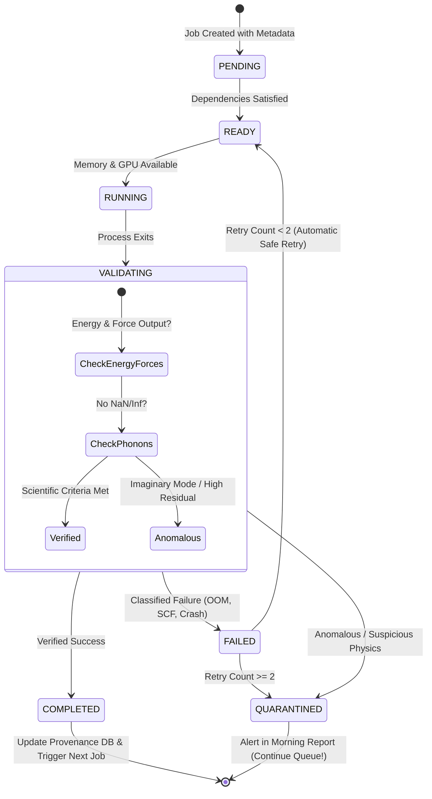

# [Architecture Proposal] PC2 Research-Node Workspace & Workflow Engine
**Date**: 2026-09-18 18:38 KST  
**Author**: Lead HPC / Computational Materials Workflow Engineer  
**Status**: PROPOSAL FOR REVIEW (Workspace structure defined; creation pending approval)  

---

## 1. Workspace Layout (`PC2_RESEARCH_NODE/`)

To prevent any pollution or accidental overwriting of active and historical research files, all operational scheduler infrastructure, job queues, provenance records, and benchmarks will be isolated in:
$$\mathbf{c:\backslash Users\backslash AOL\backslash Desktop\backslash SH.Kim\backslash PC2\_RESEARCH\_NODE\backslash}$$

### 1.1 Directory Tree Specification

```
PC2_RESEARCH_NODE/
├── config/                     # Machine configuration, memory thresholds, core policies
│   ├── hardware_limits.json    # MAX_SAFE_ATOMS = 192, RAM safety reserve (25 GB)
│   └── scheduler_config.json   # Queue polling intervals, retry limits (default 2)
│
├── scheduler/                  # Core orchestration engine (Python 3 standard library)
│   ├── engine.py               # Asynchronous state machine supervisor
│   ├── resource_guard.py       # Memory, GPU VRAM, and CPU thermal check
│   ├── validator.py            # Automated scientific validation rules (SCF, forces, phonons)
│   └── state_store.py          # SQLite + JSON ACID state ledger
│
├── jobs/                       # Four priority queues
│   ├── high/                   # Reviewer requests, paper blockers, urgent checks
│   ├── normal/                 # Active planned campaign calculations
│   ├── background/             # Large sweeps, non-urgent parameter sweeps
│   └── validation/             # Convergence suites, independent checks
│
├── running/                    # Symlinks/state pointers to currently active calculations
├── completed/                  # Validated, successful calculations with provenance receipts
├── failed/                     # Unsuccessful jobs (OOM, non-convergence, MPI crash)
├── quarantined/                # Suspicious jobs (imaginary modes, anomalous forces) for researcher review
│
├── logs/                       # System, scheduler, and node health logs
├── provenance/                 # Cryptographic input/output hashes, software environment snapshots
├── database/                   # SQLite structured metadata and provenance database
├── reports/                    # Daily automated Morning Reports (MORNING_REPORT_YYYY-MM-DD.md)
├── scripts/                    # Reusable computational scripts, parser utilities, ASE tools
├── benchmarks/                 # QE scaling benchmarks and hardware profiling
├── tests/                      # Unit tests for validation routines and parser integrity
│
└── projects/                   # Thematic research projects mapped to PhD dissertation & manuscripts
    ├── P04_INTRINSIC_PHONON/   # Pure bulk wurtzite AlN dispersion, FC2/FC3 BTE, kappa(T)
    ├── P05_DEFECT_TRANSPORT/   # Point defects (O_N, V_Al), complexes, scattering cross-sections
    ├── P06_THICKNESS_TRANSPORT/# Nanoscale thickness kappa(t), Vermeersch suppression, MFP spectra
    ├── P07_SURFACE_CHEMISTRY/  # Polar (0001) surface relaxation, hydroxylation, adsorption
    ├── P08_POST_PROCESS/       # Thermal annealing, recrystallization property retention
    ├── P09_ALN_ALN_INTERFACE/  # AlN/AlN bonding, SAB vs TCB interface energy, misorientation
    ├── P10_INTERFACE_TBC/      # AlN/Si and AlN/AlN Kapitza thermal boundary resistance (AMM/DMM)
    ├── P11_ALN_CU_SIO2/        # 3D hybrid bonding Cu/AlN and AlN/SiO2 heterojunctions
    ├── P13_MULTISCALE/         # DFT -> BTE -> Monte Carlo -> Elmer FEM multiscale solver
    └── P14_DIGITAL_TWIN/       # Sputtering process-property physics-informed model
```

---

## 2. The 8-State Job Execution State Machine

A single job failure must **never** stall the overnight queue. Every calculation transitions through an audited state machine:



### 2.1 Failure Classification Taxonomy
When a job fails, the scheduler categorizes it before taking action:
1. `OOM`: Out-of-memory detected $\rightarrow$ Job is re-queued with reduced thread count or flagged for human review.
2. `SCF_NONCONVERGENCE`: Exceeded `electron_maxstep` $\rightarrow$ Quarantined with diagnostic log.
3. `IONIC_NONCONVERGENCE`: BFGS step limit reached $\rightarrow$ Checkpoint preserved; quarantined.
4. `MPI_ERROR`: Communicator or socket drop $\rightarrow$ One automatic retry.
5. `MISSING_FILE` / `NAN_INF` $\rightarrow$ Immediate quarantine; never silently patched.

---

## 3. Daily Autonomous Morning Report Protocol

At 08:00 KST daily (or upon researcher inspection), the engine compiles a 1-page actionable summary:
`PC2_RESEARCH_NODE/reports/MORNING_REPORT_YYYY-MM-DD.md`

### Morning Report Schema:
1. **Actionable Summary**: New completed calculations, failed jobs, quarantined items.
2. **Resource Snapshot**: Host RAM, WSL2 RAM, GPU VRAM, storage capacity.
3. **Scientific Discoveries**: Newly validated thermal conductivities, surface energies, or force constants.
4. **Decisions Requiring Human Scientific Judgment**: Only items where automation must stop (e.g., evaluating physical vs numerical soft modes).
