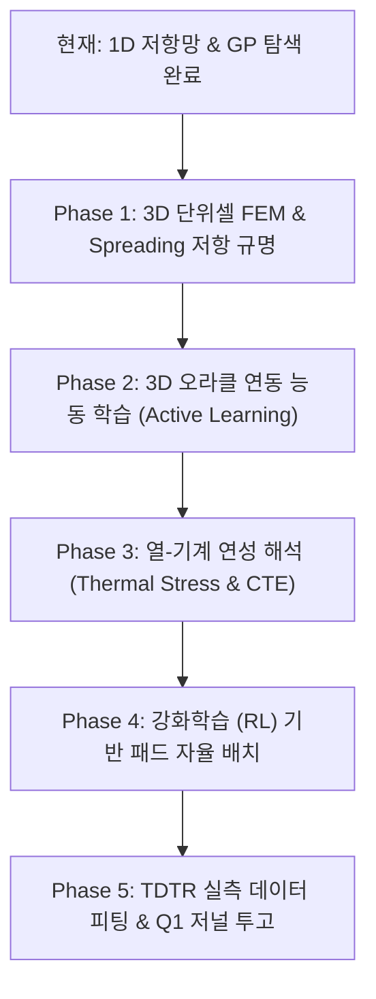

# [[Reserach1_향후_연구개발_계획서]]

## 📌 Brief Summary
`Reserach1` 프로젝트는 Si/AlN/Si 이종 접합 나노박막의 포논 열수송 해석(BTE) 및 3D 하이브리드 본딩(Cu/유전체) 24층 적층 구조의 열축적 해석을 수행한 선행 연구입니다. 1D 등가 저항망 모델 및 가우시안 프로세스(GP) 기반 반복 탐색을 완료한 현시점에서, 향후 **3D 단위셀 FEM 구축**, **열확산 저항 규명**, **열-기계(CTE) 연성 해석**, **강화학습(RL) 기반 자율 설계**, 그리고 **실측(TDTR) 연계 논문 투고**로 확장하는 단계별 마스터플랜입니다.

---

## 🧭 1. 현재 연구 자산 및 현주소 진단 (Current State Audit)

| 디렉터리/파일 | 핵심 보유 지식 및 연구 자산 | 현 단계의 한계 및 개선 포인트 |
| :--- | :--- | :--- |
| **`sim_work/`** | - Gmsh + Elmer FEM 기반 10~500 nm AlN 박막 2D 정상상태 메시 및 해석 결과 - 자연대류/강제대류/냉각판 경계조건 해석 완료 | - 단일 박막 수준의 2D 모델에 국한 - Cu 패드와 유전체가 혼합된 3D 단위셀 지오메트리 미구축 |
| **`scripts/`** | - `simulate_aln_sweep.py`: AlN 두께별 포논 분산 고려 $k(t)$ 스윕 - `simulate_hybrid_bonding_24layers.py`: 24층 적층 열축적 시뮬레이션 - `train_thermal.py` / `run_bayesian_search.py`: GP + EI 대리모델 | - `hybrid_exploration.py`가 1D 직·병렬 저항식에 의존 (Cu 면적비가 같으면 Pitch 차이를 구분 불가) - 물성치(k=40, G1/G2)가 720 nm 문헌치 외삽값에 의존 |
| **`data/`** | - `thermal_results_sweep.csv`, `aln_vs_sio2_comparison.csv` - `data/thermal_training/precision_final_20260930/`: 5개 Seed, 500회 갱신 완료 학습 데이터 | - 1D 모델 기반 데이터셋이므로 실제 3D 핫스팟 및 공간적 Spreading 저항 데이터 부재 |
| **`reports/`** | - AlN vs SiO₂ 심층 비교 보고서 (25.2배 열저항 차이, 계면 병목 현상 규명) - 학부 vs 대학원 마이크로스케일 열전달 기준 비교 - 랩미팅 8슬라이드 발표 자료 및 스크립트 완성본 | - 기존 분석 결과 간 일부 수치(CSV vs 보고서 표) 불일치 정리 필요 - AlN의 우위성이 접합 품질 시나리오에 따라 역전되는 구간 존재 |
| **`train.ps1`** | - CLI 파라미터 기반 자동화 학습 러너 및 검증 체크포인트 시스템 | - 현재 목적함수가 1D 최악온도 최소화에 머물러 있음 (다목적 최적화 미적용) |

---

## 🗺️ 2. 향후 단계별 연구개발 마스터플랜 (Phased Roadmap)

---

### 📍 Phase 1: 3D 단위셀 FEM 구축 및 열확산 저항(Spreading Resistance) 규명 (단기 / 1~2주)
- **목표:** 1D 모델의 가장 큰 한계인 **"동일 면적비에서 Pitch 차이를 반영하지 못하는 문제"**를 3D FEM 수치해석으로 해결.
- **핵심 과업:**
  1. **3D Gmsh 단위셀 파라메트릭 지오메트리 작성 (`create_3d_unitcell_geo.py`):**
     - 설계 인자: Dielectric 두께 ($50 \sim 500\,\text{nm}$), Cu Pad 직경 ($2 \sim 6\,\mu\text{m}$), Pitch ($6 \sim 15\,\mu\text{m}$), Si 두께 ($20 \sim 50\,\mu\text{m}$).
     - Cu 패드와 유전체 계면의 분할 및 접합면 비대칭 TBC ($G_1, G_2$) 3D 경계면 조건 부여.
  2. **수치 수렴성 및 열수지(Thermal Budget) 검증:**
     - 3단계 메시 리파인먼트를 통해 주요 온도 상승 및 유효 열저항 $R''$ 오차 $\le 1\%$ 확인.
     - 상·하단 열유속 면적 적분을 통해 에너지 보존 오차 $\le 0.5\%$ 달성.
  3. **Constriction / Spreading Resistance 맵 도출:**
     - Cu 패드로 열류가 집중되면서 발생하는 추가 열확산 저항 성분을 정량화하여 1D 식에 보정 계수($\eta_{\text{constriction}}$) 도입.

---

### 📍 Phase 2: 3D 고정밀 오라클 연동 능동 학습(Active Learning) 파이프라인 (단기~중기 / 2~4주)
- **목표:** 고비용 3D FEM 계산 횟수를 최소화하면서 전역 설계 공간을 정밀하게 탐색하는 서베이 모델 구축.
- **핵심 과업:**
  1. **`train_thermal.py`의 FEM Oracle 인터페이스 확장:**
     - 대리모델(GP)이 불확실성(Uncertainty)이 가장 높은 영역의 샘플을 선정 $\rightarrow$ 자동으로 3D Elmer FEM 실행 $\rightarrow$ 결과를 데이터셋에 편입하는 능동 루프(Active Loop) 완성.
  2. **비대칭 다층 핫스팟 시나리오 평가:**
     - 4 / 8 / 16 / 24 die 적층 구조에서 상부/하부 집중 발열 및 코어 영역 국소 핫스팟($10\,\text{MW/m}^2$) 배치.
     - 층간 열간섭 행렬 ($R_{ij} = \Delta T_i / q_j$) 도출.
  3. **AlN 교체 타당성 바운더리 규명:**
     - 단순 "AlN이 우수하다"가 아닌, **"Cu 면적비가 몇 % 이하이고 계면 접합 품질($G$)이 어느 수준 이상일 때 AlN이 경제적·공학적 실익을 가지는가?"**의 임계 경계면(Decision Boundary) 도출.

---

### 📍 Phase 3: 열-기계 연성 해석 (Thermo-Mechanical Stress & Warpage) (중기 / 1~2개월)
- **목표:** 방열 성능뿐 아니라 패키징 신뢰성의 핵심인 열응력 및 접합면 박리 위험도를 동시 평가.
- **핵심 과업:**
  1. **물성 불일치 응력 분석:**
     - $\text{Si}$ ($\text{CTE} \approx 2.6 \times 10^{-6}/\text{K}$), $\text{AlN}$ ($\text{CTE} \approx 4.5 \times 10^{-6}/\text{K}$), $\text{SiO}_2$ ($\text{CTE} \approx 0.5 \times 10^{-6}/\text{K}$), $\text{Cu}$ ($\text{CTE} \approx 16.5 \times 10^{-6}/\text{K}$) 간의 열팽창 차이에 따른 Von Mises 응력 해석.
  2. **접합부 전단 응력 및 박리(Delamination) 지수 계산:**
     - Cu-AlN 이종 경계면에서의 응력 집중 완화 방안 분석 (본딩 공정 온도 $300^\circ\text{C} \to$ 상온 냉각 시 잔류 응력).
  3. **다목적 파레토 프론티어(Multi-Objective Pareto Frontier) 도출:**
     - Objective 1: 핫스팟 최고 온도 최소화 ($\min T_{\max}$)
     - Objective 2: 계면 최대 열응력 최소화 ($\min \sigma_{\text{vM}}$)

---

### 📍 Phase 4: 강화학습(RL) 기반 지능형 하이브리드 본딩 레이아웃 엔진 (중장기 / 2~3개월)
- **목표:** 고정된 규칙 기반 격자 설계를 벗어나 발열 맵에 최적화된 비균일(Non-uniform) 패드 배치를 자율 설계.
- **핵심 과업:**
  1. **Gym/Gymnasium 호환 본딩 환경 구축:**
     - **상태 (State):** 층별 2D 핫스팟 열유속 맵, 현재 본딩 패드 밀도 분포.
     - **행동 (Action):** 국소 영역 Cu 패드 직경/피치 조정, AlN 더미 패턴 삽입.
     - **보상 (Reward):** $R = -(\alpha T_{\max} + \beta \sigma_{\text{vM}} + \gamma \text{Routing Penalty})$.
  2. **`[[P-Reinforce_Skill]]` 지식 엔진과의 결합:**
     - 최적화 과정에서 도출된 설계 룰을 `10_Wiki/💡 Topics/` 및 `⚖️ Decisions/`에 자동 마크다운 문서로 기록하고 GitHub 동기화.

---

### 📍 Phase 5: 실측(TDTR/FDTR) 데이터 연계 및 Q1 저널/학회 출판 (장기 / 3~6개월)
- **목표:** 순수 시뮬레이션을 넘어선 실험 검증 기반 최상위 학술지 논문 게재.
- **핵심 과업:**
  1. **TDTR (시간 분해 열반사법) 측정 데이터 피팅:**
     - Sputter / ALD 증착 AlN 박막 시료의 두께별 ($20, 50, 100, 200\,\text{nm}$) 실측 열전도도 및 계면 열전도도($G_1, G_2$) 보정.
  2. **논문 작성 및 투고 타깃:**
     - **저널 후보:** *IEEE Transactions on Electron Devices (TED)*, *Applied Thermal Engineering*, *International Journal of Heat and Mass Transfer*, *ACS Applied Electronic Materials*.
     - **논문 테마:** "Breakdown of Continuum Assumption and Spreading Resistance Inversion in 3D-Stacked Hybrid Bonding: When Does AlN Outperform SiO₂?"

---

## 💻 3. 가용 컴퓨팅 자원 배분 전략 (Resource Allocation)

| 하드웨어 자원 | 사양 요약 | 권장 연구 역할 및 실행 작업 |
| :--- | :--- | :--- |
| **노트북** | Intel i5-10300H, GTX 1650 Ti, 32 GB RAM | - 스크립트 작성, 지오메트리 파라메트릭 코드 디버깅 - 1D 저항망 및 신속 선별(Pre-screening) - 문서화, 리포트 생성 및 Git 버전 관리 |
| **PC1** | RTX 4070 Ti, 32 GB RAM | - **3D 단위셀 (단일 패드/RDL) Gmsh 메시 생성 및 수렴성 검증** - Elmer FEM 전·후처리 및 열확산 저항 맵 연산 - 다층(4~8 die) 중간 규모 열해석 |
| **PC2** | **Dual RTX 4090, 128 GB RAM** | - **16~24 die 전체 다층 3D 적층 풀 FEM 시뮬레이션** - Active Learning 대리모델 대규모 앙상블 배치 연산 - GPU 가속 기반 딥러닝/강화학습(RL) 에이전트 정책 학습 |
| *(PC3)* | *(사용 불가)* | - **계산 자원에서 완전 제외 유지 (기존 원칙 준수)** |

---

## 📋 4. 즉시 실행 가능한 다음 작업 체크리스트 (Next Action Items)

- [ ] **Data Cleansing:** `data/aln_vs_sio2_comparison.csv`와 `reports/aln_vs_sio2_scientific_comparison.md` 간의 100 nm 저항값 표기(94.81 vs 94.07) 통일 정리
- [ ] **Script 1:** `scripts/create_3d_unitcell_geo.py` 작성 (Gmsh 3D 원통형 Cu 패드 + AlN 유전체 지오메트리 자동 생성기)
- [ ] **Script 2:** 동일 Cu 면적비(30%) 조건에서 Pitch를 6 µm vs 12 µm로 변화시켰을 때의 3D FEM 열저항 비교 검증 스크립트 작성
- [ ] **Runner:** 3D 단위셀 연산을 PC1에서 원격 배치 실행할 수 있는 PowerShell 파이프라인 구축

---

## 🔗 Knowledge Connections
- **Related Topics:** [[포논 볼츠만 수송 방정식 (BTE)]], [[하이브리드 본딩 (Hybrid Bonding)]], [[가우시안 프로세스 회귀 (GPR)]], [[열확산 저항 (Spreading Resistance)]], [[열-기계 연성 해석 (Thermo-Mechanical)]]
- **Projects/Contexts:** [[Reserach1]], [[Part1 지식 보관함]], [[P-Reinforce_Skill]]
- **Contradictions/Notes:**
  - 1D 모델에서는 면적비($f_{\text{Cu}}$)가 같으면 패드 크기나 피치가 달라도 열저항이 동일하게 계산되나, 실제 3D 물리계에서는 고열유속 핫스팟의 크기가 패드 피치보다 작을 경우 극심한 열수축 저항(Constriction Resistance)이 발생하므로 3D FEM 보정이 필수적임.
  - AlN의 우수성은 계면 결함(Void)이 적고 계면 TBC가 보장될 때 극대화되며, 저품질 접합 조건에서는 Cu 경로가 전체 열류를 지배하여 유전체 대체 효과가 희석됨.

---
*Last updated: 2026-10-07*
