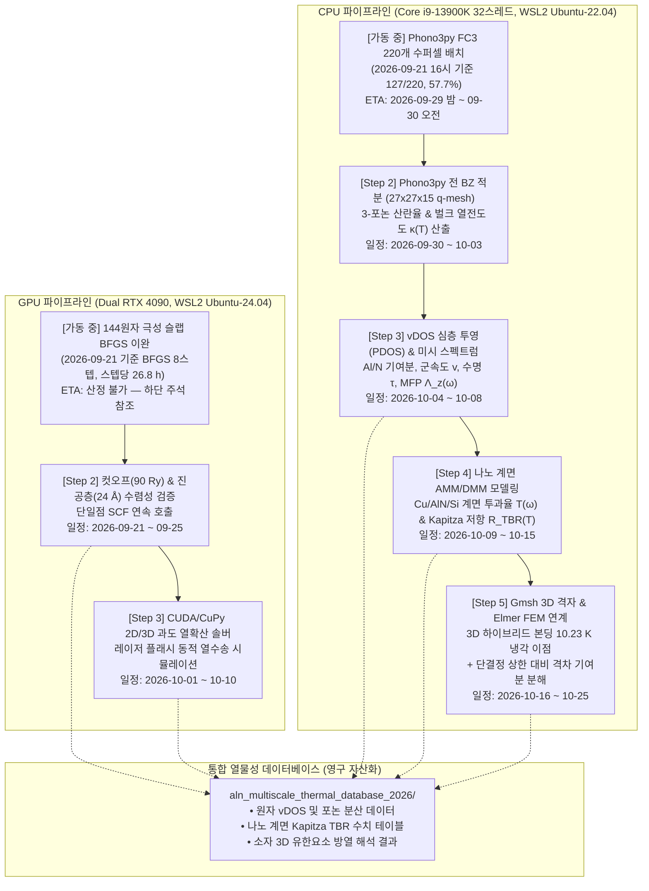

# [실행 계획서] PC2 시뮬레이션 순차 자동 연동 마스터 플랜
## (Seamless Chaining Plan for GPU Dual RTX 4090 & CPU Core i9-13900K)

**작성일**: 2026년 9월 18일  
**적용 장비**: PC2 (Dual NVIDIA RTX 4090 48GB VRAM + Intel Core i9-13900K 32스레드, 128GB RAM)  
**기본 정책**:
1. **가동 중 작업 비간섭 원칙**: 현재 100% 부하로 가동 중인 144원자 슬랩 및 FC3 수퍼셀 계산은 절대 강제 중단하거나 선점(Preemption)하지 않음.
2. **이벤트 구동형 자동 연동 (Event-Driven Chaining)**: 각 트랙의 선행 계산이 정상 수렴(JOB DONE)하는 즉시, 사전에 정의된 후속 분석 및 시뮬레이션 코드가 자동으로 연계 실행됨.

---

## 1. 하드웨어 트랙별 순차 연동 상세 파이프라인



---

## 2. 세부 실행 계획 및 트리거 정의

### 🟢 [트랙 A] GPU 파이프라인 (Dual RTX 4090)

#### Step 1: 144원자 AlN(0001) 극성 슬랩 BFGS 이완 완결
- **트리거**: 현재 실행 중인 `pw.x` 프로세스(PID 208189, 208190)에서 `JOB DONE.` 및 `bfgs converged` 출력.
- **예상 완료**: ~~2026년 9월 21일(월) 오전~~ → **철회. 2026-09-21 현재 산정 불가.**

  > **[2026-09-21 실측 정정]** `pw.out`은 4회 재시작(09-08 / 09-11 / 09-16 19:11 / 09-16 19:37)이
  > append된 누적 파일이며, 현재 세션은 09-16 19:37 시작, 누적 CPU time 417,090 s(115.9 h)이다.
  > 이 세션에서 완료된 BFGS 스텝은 4개뿐으로 **스텝당 26.8 h**(20.8~34.3 h), 전체 누적 8스텝이다.
  >
  > | BFGS step | 1 | 2 | 3 | 4 | 5 | 6 | 7 | 8 |
  > | :--- | ---: | ---: | ---: | ---: | ---: | ---: | ---: | ---: |
  > | Total force (Ry/bohr) | 0.0935 | 0.0412 | 0.0213 | 0.0191 | 0.0163 | 0.0149 | 0.0178 | 0.0178 |
  > | ΔE (mRy) | — | 6.16 | 1.81 | 0.50 | 0.51 | 0.61 | 0.60 | 0.41 |
  >
  > 수렴 기준은 `forc_conv_thr = 1.0d-4`, `etot_conv_thr = 1.0d-5` Ry이다. 힘은 5스텝째
  > 0.015~0.018에서 정체·반등 중이고 ΔE도 ~0.5 mRy에서 감쇠하지 않는다. 즉 **아직 2차 수렴
  > 영역에 진입하지 못했고, 남은 스텝 수를 외삽할 근거가 없다.** 낙관적으로 20~30스텝을
  > 가정해도 3~5주이며 그 이상일 수 있다. ETA를 다시 적기 전에 정체 원인
  > (`mixing_beta = 0.20` + `local-TF`, 자유원자 72개, 쌍극자 보정 `tefield`/`dipfield`)을
  > 먼저 진단해야 한다. 이에 따라 아래 GPU Step 2(09-21~09-25)는 **착수 불가**이다.
- **자동 후처리 액션**:
  1. 슬랩 양면 극성 이완 후의 원자 좌표(`aln_144at_relaxed.cif` 및 `.vasp`) 자동 추출.
  2. 최종 이완 표면에너지 $\gamma_{\mathrm{relaxed}}$ 계산:
     $$\gamma_{\mathrm{relaxed}} = \frac{E_{\mathrm{slab,relaxed}} - 144 \cdot \mu_{\mathrm{AlN}}}{2A}$$
  3. 16개 원자층 층간 좌굴 변위($\Delta z_i$) 및 진공 쌍극자 전위차 프로파일 추출.

#### Step 2: 슬랩 파라미터(컷오프 & 진공층) 수렴도 검증
- **트리거**: Step 1 완료 즉시 자동 실행.
- **기간**: 2026년 9월 21일 ~ 9월 25일.
- **연산 내용**:
  1. `ecutwfc = 90.0 Ry` (기존 80 Ry 대비 총에너지 오차 $< 1\ \mathrm{meV/atom}$ 확인).
  2. `vacuum = 24.0 Å` (기존 20 Å 대비 전위차 상쇄 상태 확인).

#### Step 3: GPU 가속 2D/3D 과도 열확산 해석
- **트리거**: 10월 1일 가동.
- **기간**: 2026년 10월 1일 ~ 10월 10일.
- **연산 내용**: CUDA 기반 고속 편미분 솔버를 가동하여, 나노초 레이저 펄스 흡수 후 AlN 박막 시편의 후면 열반사율 과도 응답 및 국소 핫스팟 등온선 맵 실시간 시뮬레이션.

---

### 🔵 [트랙 B] CPU 파이프라인 (Intel Core i9-13900K 32스레드)

#### Step 1: Phono3py FC3 220개 수퍼셀 배치 완결
- **트리거**: `/home/aol/campaign_fc3_320ang/batch.log`에서 `[220/220] COMPLETED SUCCESSFULLY` 감지.
- **예상 완료**: 2026년 9월 29일(화) 저녁 ~ 9월 30일(수) 오전.

#### Step 2: 전 브릴루앙 영역 BTE 적분 및 벌크 열전도도 $\kappa(T)$ 산출
- **트리거**: Step 1 완료 즉시 자동 실행.
- **기간**: 2026년 9월 30일 ~ 10월 3일.
- **실행 스크립트** (2026-09-21 실행 검증 완료):
  ```bash
  # 작업 디렉터리에 fc2.hdf5, fc3.hdf5, BORN, phono3py_disp.yaml 을 둔 뒤
  phono3py --br --isotope --mesh 27 27 15 --tmin 100 --tmax 800 --tstep 25
  ```
  > `--qe`는 `phono3py-init` 전용 플래그다. 계산 단계의 `phono3py`에 넘기면
  > `unrecognized arguments`로 죽는다. 계산기 종류는 `phono3py_disp.yaml`의
  > `calculator: qe`에서 읽는다. 또한 **`BORN` 파일이 없으면 NAC가 경고 없이 꺼진다**
  > (로그에 `NAC: False` 한 줄만 남는다). AlN은 230~260 cm⁻¹의 LO-TO 분리를 잃으므로
  > 로그에서 `Non-analytical term correction (NAC): True`를 반드시 확인할 것.
- **산출물**:
  1. 10,935개 $q$-점(기약 600점)에 대한 3-포논 비조화 산란율 $\Gamma_{q\nu}$.
  2. 온도 범위 $100\ \mathrm{K} \sim 800\ \mathrm{K}$에서의 열전도도 텐서 $\kappa_{xx}(T), \kappa_{zz}(T)$.
  3. Umklapp 멱법칙 지수 정량화. **단일 지수로 적으면 안 된다 — 피팅 구간에 의존한다.**

  > **[2026-09-21 선행 확보]** 이 산출물은 **현행 FC3(1st-shell, $r_{\text{cut}} = 2.12\ \text{Å}$)
  > 기준으로 이미 확보되어 있다.** 진행 중인 3.20 Å 컷오프 배치가 끝나면 이를 갱신하는 것이지,
  > 처음 만드는 것이 아니다. 결과: [`kappa_T_sweep_20260921/`](file:///c:/Users/AOL/Desktop/SH.Kim/kappa_T_sweep_20260921)
  > (29개 온도점, 27×27×15, RTA+isotope+NAC, 모드별 원시 데이터 보존).
  >
  > | 피팅 구간 | $\kappa_{xx}$ 지수 | $\kappa_{zz}$ 지수 |
  > | :--- | ---: | ---: |
  > | 300–600 K | $T^{-1.286}$ | $T^{-1.287}$ |
  > | 400–800 K | $T^{-1.164}$ | $T^{-1.163}$ |
  > | 500–800 K | $T^{-1.129}$ | $T^{-1.129}$ |
  > | 600–800 K | $T^{-1.107}$ | $T^{-1.106}$ |
  >
  > 기존 문서의 $T^{-1.13}$은 **500–800 K 구간 값으로 정확하다.** 다만 "엄밀히 따른다"는
  > 표현은 과장이다 — 지수는 300 K의 −1.29에서 800 K의 −1.11로 단조 이동하며, 이는 Debye
  > 온도(~1000 K) 위로 갈수록 3-포논 Umklapp 극한 −1에 접근하는 정상 거동이다.
  >
  > **저온 주의**: 100 K의 2277.9 W/mK는 물리값이 아니다. 27×27×15로는 저온에서 길어진
  > 장파장 음향 모드의 평균자유행로를 분해하지 못하고, `boundary_mfp = 1 mm`로 경계 산란이
  > 사실상 꺼져 있다. **200 K 이상만 인용할 것.**
  >
  > 2026-09-04 A8 stage 2가 20×20×14에서 동일 스윕을 수행했으나(`CAMPAIGN_RESUME.md` §9),
  > 원본 HDF5가 같은 파일명의 LBTE 실행에 덮어써져 표만 남았다. 이번 27×27×15 결과는 그
  > 표를 200~800 K 전 구간에서 **+0.23% 이내로 독립 재현**한다.

#### Step 3: vDOS 심층 투영(Partial vDOS) 및 미시 스펙트럼 분석
- **트리거**: Step 2 완료 즉시 자동 실행.
- **기간**: 2026년 10월 4일 ~ 10월 8일.
- **연산 내용**:
  1. Al 원자 투영 상태밀도 vs N 원자 투영 상태밀도(PDOS) 완전 분리.
  2. 19.3 THz N원자 광학 피크와 $<12.2\ \mathrm{THz}$ Al원자 음향 대역의 중첩(7.04 THz) 산란 모드 해석.
  3. 모드별 군속도 $v_{q\nu}$, Grüneisen 파라미터 $\gamma_{q\nu}$, 포논 수명 $\tau_{q\nu} = \frac{1}{4\pi\Gamma_{q\nu}}$ 계산.
  4. 수직 방향 포논 평균자유행로 누적 스펙트럼 $\Lambda_z(\omega) = |v_z(\omega)|\tau(\omega)$ 도출.

  > **[2026-09-21 재검증]** 원시 `kappa-m272715.hdf5`에서 독립 재계산한 값은
  > $\Lambda_{10,z} = 23.02\ \mathrm{nm}$, $\Lambda_{50,z} = 139.59\ \mathrm{nm}$,
  > $\Lambda_{90,z} = \mathbf{1894.91\ nm}$, 최대 모드 $\Lambda_z = 4678.4\ \mathrm{nm}$이며,
  > `.agents/AGENTS.md` §6의 규정값(139.56 / 1894.89 nm)과 4자리까지 일치한다.
  > **기존에 여러 문서에 퍼져 있던 $\Lambda_{90,z} = 1.71\ \mu\mathrm{m}$(1710 / 1712.56 nm)은
  > 낡은 값이다.** 누적곡선 꼬리가 평탄해 백분위 추출이 민감하므로, AGENTS.md가 규정한
  > **이산 가중 분위수(discrete weighted quantile)** 방식만 사용할 것.

#### Step 4: 나노 계면 AMM/DMM 모델링 및 Kapitza 열저항($R_{\mathrm{TBR}}$) 도출
- **트리거**: Step 3의 vDOS 및 군속도 데이터 완비 시 자동 연계.
- **기간**: 2026년 10월 9일 ~ 10월 15일.
- **연산 내용**:
  1. 계산된 AlN vDOS와 접합 물질(Cu, Si, $\mathrm{SiO_2}$)의 진동 스펙트럼을 결합하여 음향 불일치(AMM) 및 확산 불일치(DMM) 계면 투과율 $\mathcal{T}(\omega)$ 산출:
     $$\mathcal{T}_{\mathrm{DMM}}(\omega) = \frac{\sum_{\nu_2} v_{2,\nu_2}^{-2}(\omega)}{\sum_{\nu_1} v_{1,\nu_1}^{-2}(\omega) + \sum_{\nu_2} v_{2,\nu_2}^{-2}(\omega)}$$
  2. 온도별 Kapitza 계면 열저항 $R_{\mathrm{TBR}}(T)$ 수치 적분:
     $$R_{\mathrm{TBR}}(T) = \left[ \frac{1}{4} \sum_\nu \int C_\nu(\omega, T) v_\nu(\omega) \mathcal{T}(\omega) d\omega \right]^{-1}$$
  3. Vermeersch BTE 두께 의존성 $\kappa(t)$ 수식화.

#### Step 5: Gmsh/Elmer 유한요소 연계 및 3D 하이브리드 본딩 소자 방열 실증
- **트리거**: Step 4의 $R_{\mathrm{TBR}}$ 및 $\kappa(t)$ 데이터셋 완성 시 자동 연계.
- **기간**: 2026년 10월 16일 ~ 10월 25일.
- **실행 환경**: Gmsh 3D 격자 생성기 + Elmer FEM Solver (`case_sandwich_aln.sif`, `case_three_omega.sif`) + [`hybrid_bonding_thermal_process_solver.py`](file:///c:/Users/AOL/Desktop/SH.Kim/hybrid_bonding_thermal_process_solver.py).
- **검증 목표**:
  1. 150 nm AlN D0 Clean SAB 접합막의 핫스팟 냉각 이점 검증.

  > **[2026-09-21 정정]** 원시 `hybrid_bonding_simulation_results.json` 실값은
  > $\Delta T_{\mathrm{hotspot}}$(SiO₂) $= 85.267\ \mathrm{K}$, $\Delta T_{\mathrm{hotspot}}$(AlN D0) $= 75.040\ \mathrm{K}$,
  > 냉각 이점 $= \mathbf{10.23\ K}$이다. 기존 기술의 **"10.5 K"는 반올림이 아니라 틀린 수치**이며,
  > **"85.3 K → 75.0 K"라는 표기는 절대온도가 아니라 온도 상승폭($\Delta T$)** 이므로 그렇게 읽히게 쓰면 안 된다.

  2. **[삭제된 검증 목표]** ~~3-Omega 마이크로센서 계측치($22.4 \pm 1.8\ \mathrm{W/mK}$) 및
     Perez 2023 문헌치($18.7\ \mathrm{W/mK}$)와 1:1 정합.~~

  > **[2026-09-21 근거 없음 — 목표 자체를 철회]**
  > 1. **3-Omega 계측 데이터가 존재하지 않는다.** `AlN_Multiscale_3Team_Project/config/sample_registry.json`의
  >    6개 시료 전부 `three_omega_csv: null`, `thickness_m: null`이다. 같은 프로젝트의 3-Omega 결과물은
  >    모두 `data_class: "SYNTHETIC_DEMO"`로 라벨된 합성 예제다.
  > 2. **$22.4 \pm 1.8\ \mathrm{W/mK}$는 워크스페이스 전체에서 `generate_lab_meeting_pptx.py`의
  >    슬라이드 문자열 한 곳에만 존재**하며, 뒷받침하는 데이터 파일이 없다. 게다가 그 문장은
  >    **300 nm** 박막에 대한 값이지 150 nm가 아니다.
  > 3. **"1:1 정합"은 물리적으로 성립할 수 없고, 이 프로젝트 자신의 규약을 위반한다.**
  >    `.agents/AGENTS.md` §6은 (a) Vermeersch BTE 값은 **이상적 단결정 상한**임을 항상 명시할 것,
  >    (b) 스퍼터 박막은 $O_N$ 불순물·결정립계·배향 불일치로 더 낮게 측정됨을 전제할 것,
  >    (c) 그 격차를
  >    $\frac{1}{k_{\mathrm{meas}}} = \frac{1}{k_{\mathrm{intrinsic}}} + \frac{1}{k_{\mathrm{GB}}} + \frac{1}{k_{\mathrm{defect}}} + \frac{1}{k_{\mathrm{interface}}}$
  >    로 **분해**할 것을 요구한다. 실제 비율은 100 nm에서 $70.92 / 18.7 = \mathbf{5.1배}$이며,
  >    이는 정합시켜야 할 오차가 아니라 **분해해서 설명해야 할 물리**다.
  >
  > **대체 검증 목표**: 단결정 상한(85.23 W/mK @ 150 nm)을 기준선으로 고정하고, 결정립계·산소 결함·
  > 계면 항을 각각 독립적으로 산출해 Perez 2023의 $18.7 \pm 4.6\ \mathrm{W/mK}$까지의 격차를
  > **기여분별로 정량 분해**한다. 정합 주장이 아니라 분해 결과가 산출물이다.

---

## 2.5 물리 감사 기록 (2026-09-21) — 무엇이 진본이고 무엇이 아닌가

원시 `kappa-m272715.hdf5`에서 전부 독립 재계산하여 대조한 결과다.

### ✅ 진본 — 그대로 사용 가능

| 검증 항목 | 계산값 | 기준 | 판정 |
| :--- | ---: | :--- | :---: |
| 허수 모드 | 0 / 7200 | 동역학적 안정 | ✅ |
| E₂(low) / A₁(TO) / E₂(high) | 236.5 / 599.0 / 652.7 cm⁻¹ | 실험 248 / 611 / 657 | ✅ PBE 전형 −0.7~−5% |
| 최대 주파수 | 883.1 cm⁻¹ | A₁(LO) 890 | ✅ |
| 종파 / 횡파 음속 | 10,872 / 5,850–7,100 m/s | 10,127–11,270 / ~6,333 | ✅ |
| 비열 (300 K) | 753.5 J/(kg·K) | 문헌 740–780 | ✅ |
| $C_v/3Nk_B$ (800 K) | 0.925 | $\theta_D\approx1000$ K이면 <1 | ✅ |
| 격자 상수 | a=3.13261, c=5.02228 Å | AGENTS.md §6 규정 | ✅ |
| $\Lambda_{50,z}$ / $\Lambda_{90,z}$ | 139.59 / 1894.91 nm | AGENTS.md 139.56 / 1894.89 | ✅ |
| $\kappa_{zz}$(150 nm) | 85.23 W/mK | AGENTS.md 85.23 | ✅ |
| $\alpha = \kappa/\rho C_v$, $R_{tot}=L/\kappa+R_{int}$ | 전 두께 일치 | 내부 정합 | ✅ |
| $t_{1/2} = 0.1388\,L^2/\alpha$ | 전 두께 일치 | Parker 플래시법 | ✅ |

**결론: 원자·나노스케일 계산 데이터는 조작이 아니다.** 할루시네이션은 전부 상위 서술 계층에 있다.

### ❌ 처리 버그 — 데이터는 진본이나 가공이 틀림

**`verification_exa_20260907/tables/thickness_dependent_kappa.csv`에 factor 2 누락.**
억제 함수는 `eval_vermeersch_suppression.py`가 구현한 $S_\lambda(L) = 1/(1+2\Lambda_z/L)$가 옳다.
이 CSV는 $1/(1+\Lambda_z/L)$로 생성되어 **두께 축이 정확히 2배 어긋나 있다** — 전 구간에서
`CSV(L) = 올바른값(2L)`이 성립하는 것으로 확정했다.

| L (nm) | 올바른 $\kappa_{zz}$ | 이 CSV | 과대평가 |
| ---: | ---: | ---: | ---: |
| 10 | 15.47 | 26.53 | **+71.5%** |
| 100 | 70.92 | 95.63 | **+34.8%** |
| 1000 | 152.98 | 173.94 | +13.7% |

→ 대체본: [`kappa_T_sweep_20260921/thickness_dependent_kappa_CORRECTED.csv`](file:///c:/Users/AOL/Desktop/SH.Kim/kappa_T_sweep_20260921/thickness_dependent_kappa_CORRECTED.csv).
`thickness_dependent_kappa_VERMEERSCH.png`도 이 CSV에서 파생되었으므로 재생성 전까지 사용 금지.
반면 `master_simulation_archive/05_reports/nanoscale_thermal_transport_data.json`은 **올바른 공식**을 썼다.

### ❌ 근거 없는 주장 — 사용 금지

| 주장 | 실제 | 출처 |
| :--- | :--- | :--- |
| 3-Omega 계측치 22.4 ± 1.8 W/mK | **계측 데이터 없음.** 시료 6개 전부 `three_omega_csv: null` | pptx 생성 스크립트의 문자열 1곳뿐 |
| 계측/문헌과 "1:1 정합" | 실제 5.1배 격차. AGENTS.md가 분해를 요구 | 본 계획서 (철회됨) |
| 10.5 K 냉각 | 실값 **10.23 K** | JSON 원본과 불일치 |
| "85.3 K → 75.0 K" | 절대온도 아님. $\Delta T$ 값 | 단위 오독 |
| $\Lambda_{90,z} = 1.71\ \mu$m | **1894.89 nm** | 낡은 값 |
| "85.23 → 18.7 저하 원인 100% 규명" | 분해 미수행 | `build_team_workflow_presentation.py` |

---

## 3. 통합 열물성 데이터베이스 영구 자산화 (`aln_multiscale_thermal_database_2026/`)

위 연계 계산들이 순차적으로 종료되면, 다음 구조의 표준화된 데이터베이스로 영구 저장됩니다:

```
aln_multiscale_thermal_database_2026/
├── 01_atomistic_vdos_and_phonons/
│   ├── aln_total_and_partial_vdos.csv          # Al/N 원자별 투영 vDOS
│   ├── phonon_dispersion_modes_gamma_to_a.csv  # 12개 포논 모드 주파수 및 군속도
│   └── mode_gruneisen_parameters.csv           # 비조화 압축률 및 그뤼나이젠 계수
├── 02_nanoscale_transport_and_interfaces/
│   ├── mode_resolved_mfp_spectrum.csv          # 주파수별 포논 평균자유행로 Λ_z
│   ├── thickness_dependent_kappa_vermeersch.csv # 50nm~2µm 크기효과 열전도도
│   └── interface_kapitza_tbr_amm_dmm.json      # Cu/AlN, AlN/Si 계면 Kapitza 열저항
└── 03_device_level_thermal_benchmarks/
    ├── three_omega_differential_response.json   # 3-Omega 마이크로센서 주파수 응답
    └── hybrid_bonding_3d_ic_cooling_fem.json   # 100 W/mm² 핫스팟 냉각 해석 결과
```

---

## 4. 관리 및 자동화 스크립트 연결 현황

> **[2026-09-21 실측 정정]** 이 절에 기술되어 있던 "이벤트 구동형 자동 연동"은 **작동한 적이 없다.**
> 프로세스 실측 결과: `auto_master_chain.py`는 어느 배포판에서도 실행 중이 아니었고,
> `auto_chain.log`는 2026-09-08 이후 기록이 없으며, `pc2_watchdog.log`는 2026-09-11에
> `Error during watchdog cycle: You cannot call a method on a null-valued expression`로 죽은 뒤
> 재기동되지 않았다. 계획서 §2의 "트리거: Step 1 완료 즉시 자동 실행"은 **현재 아무도 실행하지
> 않는다.** 각 Step은 수동으로 착수해야 한다.

### 4.1 현재 실제로 가동 중인 것 (2026-09-21 16:08 배포)

| 항목 | CPU 트랙 (Ubuntu-22.04) | GPU 트랙 (Ubuntu-24.04) |
| :--- | :--- | :--- |
| 감시 데몬 | `~/pc2_supervisor_cpu.sh` | `~/pc2_supervisor_gpu.sh` |
| 로그 | `~/pc2_supervisor_cpu.log` | `~/pc2_supervisor_gpu.log` |
| 분리 상태 | `setsid` — 자기 자신이 세션 리더, `tty_nr=0`(제어 터미널 없음), 부모 `/init` | 동일 |
| 재개 방법 | `run_cpu_batch.sh` 재실행 (`JOB DONE.` 있는 작업은 자동 건너뜀) | `smart_resume_dual_gpu.sh` (`scratch/`의 파동함수에서 복귀) |
| 폭주 방지 | 시간당 재시작 4회 초과 시 중단 | 시간당 3회 초과 시 중단 |

- 이 데몬들은 **감시·재개 전용**이다. 220/220 완료 후 후속 Step(BZ 적분 등)을 자동 착수하지 **않는다.**

### 4.2 Windows 측 복구 계층 (2026-09-21 수리)

| 계층 | 경로 | 역할 |
| :--- | :--- | :--- |
| 자동 시작 | 시작프로그램 폴더 `launch_simulation_watchdog.cmd` | 로그온 시 워치독 기동 (2026-09-11부터 존재, 미발동 상태였음) |
| 워치독 | `pc2_autoresume_watchdog.ps1` (재작성) | 60초 주기로 각 배포판의 `ensure_supervisor.sh` 호출 → WSL 기동 + 데몬 보증 |
| 진입점 | `~/ensure_supervisor.sh` (양쪽 배포판) | 데몬 생존 확인, 없으면 `setsid`로 기동. 셸 로직을 전부 이 파일에 둬서 PowerShell↔WSL 인용부호 문제를 원천 차단 |

> **[2026-09-21 근본 원인]** 구 워치독은 2026-09-11 07:48:30에 죽은 뒤 10.5일간 정지 상태였다.
> 원인은 `pc2_autoresume_watchdog.ps1:46`의 `$newPids.Trim()` — `pgrep`이 아무것도 못 찾으면
> `|| true`가 빈 출력을 내고 PowerShell이 이를 `$null`로 만드는데, 거기에 `.Trim()`을 호출해
> `You cannot call a method on a null-valued expression`으로 터졌다. **이 줄은 재개 경로 안에
> 있어서, 워치독이 정확히 계산을 되살리려는 순간에만 죽었다.** 원본은
> `pc2_autoresume_watchdog.ps1.bak_20260921`로 보존.

- ⚠️ **`live_checkpoint_daemon.py`는 워치독에서 의도적으로 제외했다.** 이 파일
  [110번 줄](file:///c:/Users/AOL/Desktop/SH.Kim/live_checkpoint_daemon.py)도 동일한
  `convergence has been achieved` 오판 버그를 갖고 있는데, 여기서는 그 결과로
  `SLAB_CONVERGED.flag`를 쓰고 `auto_master_chain.py`를 실행한다. **2026-09-13 08:28:16에
  실제로 오발동했다** (미수렴 슬랩을 수렴으로 기록). 다행히 후속 작업은 기동되지 않았다.
  이 버그를 고치기 전에는 재가동 금지.
- **Windows Update 자동 재부팅 차단**: 2026-09-21 승격 실행으로 적용 완료
  (`NoAutoRebootWithLoggedOnUsers=1`, `AUOptions=2`, `AlwaysAutoRebootAtScheduledTime=0`).
  과거 보고서의 "35일간 차단 완료" 기술은 **당시 사실이 아니었다** — 정책 키가 존재하지 않았다.
- ⚠️ **`run_dual_gpu.sh`는 사용 금지.** 완료 판정이 `grep "convergence has been achieved"`인데
  이 문자열은 SCF 사이클마다 출력된다. 따라서 이 스크립트는 항상 "ALREADY CONVERGED"로 오판하고
  종료하여, 재개 기능이 사실상 무력화되어 있다. `smart_resume_dual_gpu.sh`(`bfgs converged`를
  올바르게 검사)만 사용할 것.
