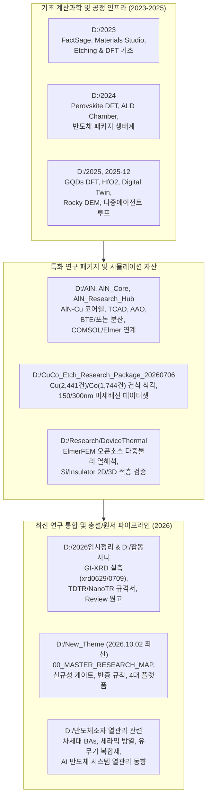
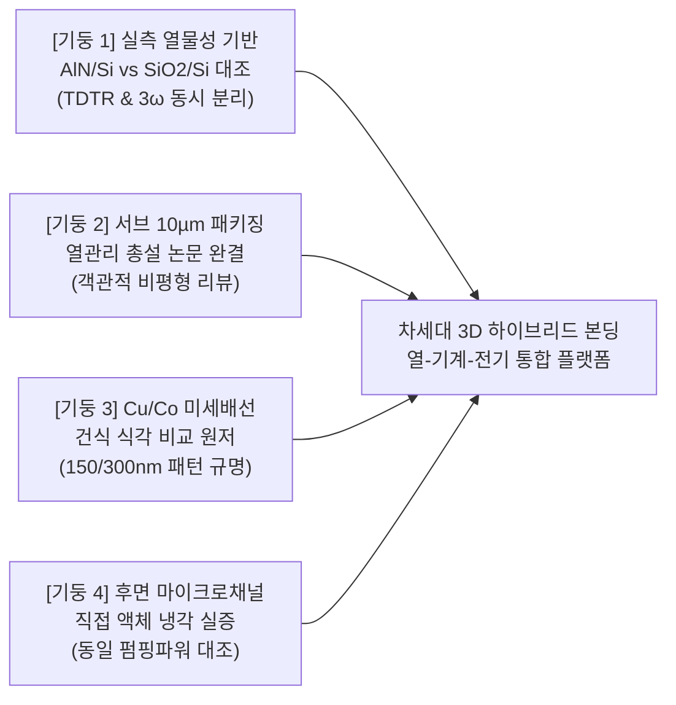
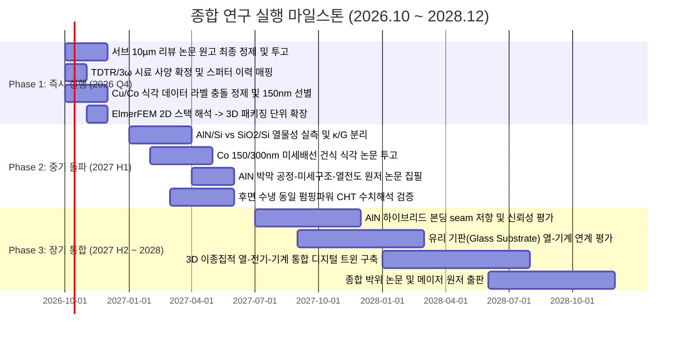
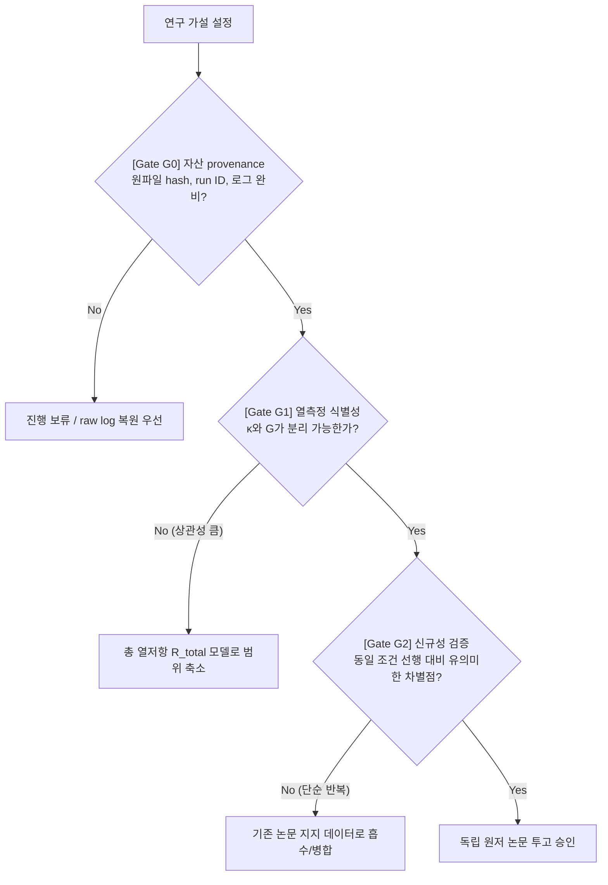

# D:\ 드라이브 15개 연구 폴더 지식 통합 및 향후 R&D 종합 마스터 플랜

> **문서 버전:** 1.0 (2026-10-07 기준)  
> **기반 데이터:** `D:\2023`, `D:\2024`, `D:\2025`, `D:\2025-12`, `D:\2026임시정리`, `D:\AlN`, `D:\AlN_Core`, `D:\AlN_Research_Hub`, `D:\AlN_Temp_Archive`, `D:\CuCo_Etch_Research_Package_20260706`, `D:\New_Theme`, `D:\Research`, `D:\Research_Cloud_Staging_20260722\C_Downloads_Research`, `D:\반도체소자 열관리 관련`, `D:\잡동사니`  
> **핵심 원칙:** 엄격한 연구 진실성 (No Hallucination), 데이터 출처 분리 (`MEASURED`, `SIMULATED`, `LITERATURE`, `USER-REPORTED`), 반증 가능성 중심의 게이트 관리 (Kill Tests).

---

## 1. 15개 연구 폴더 지식 자산 전수 맵 (Knowledge Landscape)

각 폴더는 단순 아카이브가 아니라, **기초 열역학/계산화학(2023) → 나노소재·DFT·디지털트윈(2024~2025) → AlN 방열/Cu·Co 식각/하이브리드 본딩 전문 패키지(2026 중반) → 엄격한 서지검증 및 반증 중심 통합 로드맵(2026.10 최신)**으로 진화해 온 유기적 연구 체계입니다.

### 15개 폴더별 자산 상세 분석표

| 폴더 경로 | 주요 보유 지식 및 핵심 자산 | 연구 성숙도 (TRL/Status) | 연계 파이프라인 |
| :--- | :--- | :--- | :--- |
| **`D:\2023`** | FactSage 열역학 계산, Materials Studio (DS Biovia), Etching & DFT 기초, Moltemplate, 인하대 반도체 공급망 세미나 | 기초 인프라 (Foundational) | 공정 열역학 평형 상태 계산 및 원자 모델링 레퍼런스 |
| **`D:\2024`** | 페로브스카이트(CsPbI3, FAPbBr3) DFT 계산, ALD 챔버 기초, 패키지 어셈블리/기판 생태계, 신규 특허 목록 | 모델링 확장 (Exploratory) | 제일원리 전자구조 해석 및 ALD 박막 증착 메커니즘 |
| **`D:\2025`** | GQD(그래핀 양자점) DFT, HfO2 강유전/유전체, Digital Twin 개념, Rocky DEM, Gaussian 매뉴얼 | 다중스케일 해석 (Intermediate) | 결함 거동, 나노 열전도 분산 및 입자 유동 전산모사 |
| **`D:\2025-12`** | 랩미팅 종합, 세미나 확장 자료, 리포트, 자동 파일 분류 파이프라인 | 연구 전환기 (Transition) | 2025년도 연구 결산 및 2026년도 R&D 과제 기획 연결 |
| **`D:\2026임시정리`** | **실측 XRD 데이터 (`xrd0629`, `xrd0709`, `0902_renew_XRD.opju`)**, **TDTR/NanoTR 분석 시료 규격서**, 유리 기판(`0. Introduction - 유리 기판.pdf`), `hybrid_bonding_rom` (차수축소모델 에이전트), VASP-Gibbs, VESTA | **실험 진행/계측 준비 (Active Lab)** | **AlN 박막 스퍼터링 공정이력 매핑 및 TDTR 실측 시편 제작** |
| **`D:\AlN`** | 다중에이전트 R&D 루프, TCAD 시뮬레이션, AAO(양극산화알루미늄) 템플릿 하이브리드 본딩/TIM 설계, CAD 산출물 | 플랫폼 구축 완료 (Structured) | 서브 10 µm 인터페이스 열방출 구조 설계 |
| **`D:\AlN_Core`** | **AlN-Cu Core-Shell 최적화 공정 (`AlN_Core-Shell_Final_Report.md`)**, 3 µm Cu Core + 3.5 µm AlN Shell (10 µm pitch), 열응력 반감(419 MPa) 도출 데이터 | 핵심 설계 수렴 (Converged Design) | 하이브리드 본딩 범프 미세피치 열-기계 신뢰성 설계 |
| **`D:\AlN_Research_Hub`** | Phase 2.0~2.3 검증 아카이브, **서지 정보 할루시네이션 원천 박멸 체계 (`RESUME_CHECKPOINT.md`)**, Blender 렌더 파이프라인, COMSOL 배치 인터페이스, 실측 데이터 저장소 | 거버넌스 완료 (Verified Hub) | 물리 기반 포논 산란(Eq. S4, Eq. 7), MFP 스펙트럼 재사용 |
| **`D:\AlN_Temp_Archive`** | Quantum ESPRESSO 스크래치 계산(`qe_scratch_pc1_gate0...`), WSL 크래시 덤프 및 로그 | 원시 연산 보존 (Scratch Backup) | DFT 전자-포논 산란 연산 provenance 추적 및 복원용 |
| **`D:\CuCo_Etch_Research_Package_20260706`** | **Cu(2,441건)/Co(1,744건) 건식 식각 데이터셋**, Co 150/300 nm 패턴 덱, 6단계 연속 계획서(`six_step_cuco_continuation.md`), 재료 라벨 충돌 관리 | 패키지화 완료 (Near Publication) | **Cu vs Co 미세배선 식각 선택비·프로파일 비교 원저 논문** |
| **`D:\New_Theme`** | **2026-10-02 최신 통합 마스터맵 (`00_MASTER_RESEARCH_MAP.md`)**, 4대 플랫폼 우선순위, 신규성 게이트, 반증/중단 규칙(Kill Tests), 187편 문헌 스크리닝 대장 | **전략 사령탑 (Master Blueprint)** | **향후 2026.10~2028 전체 연구 수행의 기준 나침반** |
| **`D:\Research` (DeviceThermal)** | **ElmerFEM 오픈소스 다중물리 열해석 케이스 (`VALIDATION_001`)**, Gmsh 격자(`stack.geo/msh`), Heat Equation BiCGStab 솔버, ParaView VTU 파이프라인 | 해석 엔진 검증 (Validated Solver) | 패키징 다층 박막(Si/AlN/Cu) 정상상태 열전도 2D/3D 수치해석 |
| **`D:\Research_Cloud_Staging_20260722`** | 2026-06월 리뷰 원고 버전(`260601_SH_Review_Manuscript_V2.docx` 등), 연구실 협업 파일(LeeJH), HTBF 원고 | 클라우드 동기화 (Sync Archive) | 원고 개정 이력 추적 및 공저자 피드백 반영 |
| **`D:\반도체소자 열관리 관련`** | AI 반도체 발열관리, 방열 세라믹 최신동향, 차세대 BAs(붕화비소), 유무기 하이브리드 고방열 복합재 기획보고서 | 배경 지식/동향 (Contextual Domain) | 리뷰 논문 서론/산업적 배경 및 차세대 재료군 비교 분석 |
| **`D:\잡동사니`** | **리뷰 재구조화 청사진 (`20260315_review_restructure_blueprint.md`)**, 도표 패키지 13종/표 5종 매니페스트, IMID 2026 초록 3편, CV | 원고 패키지 원천 (Manuscript Core) | **서브 10 µm 열수송 총설 논문 투고용 패키지 완성** |

---

## 2. 4대 전략 연구 기둥 (Core Strategic Pillars)

`D:\New_Theme`의 최신 검증 규칙과 기존 14개 폴더의 실제 자산을 교차 매핑하여 도출한 **향후 집중 연구 기둥**입니다.

---

### 기둥 1: AlN 박막 및 하이브리드 본딩 실측 열물성 규명 (최우선 실험 트랙)
- **핵심 질문:** 실제 공정 이력(RF 스퍼터 조건, 프리 스퍼터링 시간, 타깃 상태)이 제어된 AlN/Si 박막에서, **박막 자체의 열전도도($\kappa_\perp$)와 계면 열컨덕턴스($G$, 또는 $TBR$)를 TDTR 및 3ω 분석을 통해 오차 범위 내에서 통계적으로 독립 식별(Deconvolution)**할 수 있는가?
- **보유 자산:**
  - `D:\2026임시정리\TDTR 분석 준비`: `NanoTR시료규격.pdf`, `열물성분석실시료규격.pdf` 확보 완료.
  - `D:\2026임시정리\xrd0629`, `xrd0709`, `0902_renew_XRD.opju`: GI-XRD, (0002) 피크 실측 데이터 보유.
  - 베이스라인 공정 조건 확보: Si(100), Al 타깃, RF ~250 W, ~4 mTorr, N2:Ar = 16:4 sccm, 상온/저온 스퍼터링.
- **돌파 과제 및 게이트 (Gate G1):**
  - 분석기관의 Al 트랜스듀서 증착 요구사항(두께 ~100 nm, 조도, 열처리 이력) 확정.
  - "벌크 AlN $k=319\text{ W/m}\cdot\text{K}$" 주장 배제 $\rightarrow$ 서브 300 nm 박막에서의 입계 산란(Grain Boundary) 및 산소 불순물 산란 반영 실측 모델 제시 ($k_\perp \sim 20\text{--}50\text{ W/m}\cdot\text{K}$ 수준의 현실적 영역 입증).

---

### 기둥 2: 서브 10 µm 3D 패키징 열수송 총설 논문 투고 (최우선 출판 트랙)
- **권장 제목:**  
  `Sub-10 μm Thermal Pathways in 3D Semiconductor Packaging: Thin-Film, Interfacial, and Dielectric-Materials Perspectives`  
  *(또는 `Thermal Management and Metrology for Sub-10 um Heat-Flow Pathways in 3D Semiconductor Packaging: Thin-Film and Interfacial Limits with AlN as a Candidate Dielectric`)*
- **보유 자산:**
  - `D:\잡동사니\20260315_review_restructure_blueprint.md` & `20260315_thermal_aln_core_files_summary.md`
  - 기작성 메인 원고: `260315_SH_TM__Review_Integrated_Final_Submission.docx` (및 `D:\Research_Cloud_Staging_20260722` 내의 260601/260608 개정본).
  - 완성된 도표 패키지: Figure 1~13 (PNG) 및 Table 1~5 (CSV/Preview).
  - 기초 물성 문헌 풀: Cahill et al. (2003, 2014) 나노스케일 열수송 시리즈 포함.
- **핵심 수정 방향:**
  - AlN의 일방적 옹호(Advocacy) 톤을 배제하고, **SiO₂ 대체 후보군(AlN, SiCN, Al₂O₃, low-k)의 열적·전기적(TDDB/누설)·기계적(CMP 디싱/응력) 트레이드오프를 객관적으로 비교**하는 정통 비평형(Critical Review) 구조로 전환.
  - 서브 10 µm 영역에서의 포논 평균 자유 행로(MFP) 스펙트럼 억제 효과 및 계면 접합선 저항($R_{seam}$)의 측정 한계 집중 분석.

---

### 기둥 3: Cu/Co 미세배선 건식 식각 비교 원저 논문 (데이터셋 기반 트랙)
- **핵심 질문:** 150 nm / 300 nm 스케일의 첨단 인터커넥트 건식 식각에서, Cu 대비 Co의 이방성 식각 선택비, 측벽 프로파일(Sidewall Angle), 재증착(Redeposition), 잔여물(Residue) 제어 기작의 정량적 차이는 무엇인가?
- **보유 자산:**
  - `D:\CuCo_Etch_Research_Package_20260706`: Cu 패널 케이스 2,441건, Co 검증 후보 이미지 1,744건.
  - `04_comparison/cu_co_case_comparison_for_fine_metal_lines.md`, `micro_metal_line_applicability_matrix.csv`.
- **돌파 과제 및 게이트:**
  - 4,661건의 재료 라벨 충돌(`material_label_conflicts.csv`) 스크립트 기반 정제.
  - Co PPTX 내부 슬라이드 이미지 매핑 완결 후, 단순 머신러닝 예측이 아닌 **공정 가스계별(화학 흡착 vs 이온 충돌) 메커니즘 해석 기반의 비교 원저 작성**.

---

### 기둥 4: 후면 마이크로채널(Backside Microchannel) 직접 액랭 실증 (시스템 열해석 트랙)
- **핵심 질문:** 동일 풋프린트(Footprint), 동일 발열량(Heat Flux), **동일 펌핑 파워(Pumping Power)** 조건에서, 제안된 후면 유체 유로 구조가 기존 직접 접합 Si-Si 유로 선행연구(Qiu et al., 2020) 대비 실제적인 유효 열저항 감소를 달성하는가?
- **보유 자산:**
  - `D:\New_Theme\조사 주제 정리 및 연구 공개 분석\Backside_Microchannel\Internal_Fluid_Cooling`
  - `D:\Research\DeviceThermal`: ElmerFEM HeatSolver 2D/3D 정상상태 전산모사 환경.
  - 계산 파이프라인: `screening.py`, `water_screen.csv` (정사각관 차압 $\Delta p$ 계산).
- **돌파 과제 및 게이트 (Gate G-B):**
  - 압력 강하와 누설(Leakage), 잔여 Si 두께에 따른 기계적 강도 한계를 수치적으로 결합하지 않은 단순 CFD 결과는 출판 금지.
  - CHT(Conjugate Heat Transfer) 검증 모델을 통해 신뢰할 수 있는 영역(Regime Boundary) 제시.

---

## 3. 단계별 추진 로드맵 (Phase-by-Phase Roadmap: 2026.10 ~ 2028)

---

### Phase 1: 기반 정제 및 즉시 투고 준비 (2026.10 ~ 2026.12)

#### 1.1 리뷰 논문 최종화 및 서브미션 (Track A)
- **작업 내용:** `D:\잡동사니`의 `260315_SH_TM__Review_Integrated_Final_Submission.docx`와 `D:\Research_Cloud_Staging_20260722` 내 최신 원고를 대조 동기화.
- **세부 작업:**
  - Figure 1~13 및 Table 1~5 캡션 번호 재검증.
  - 최신 2025~2026 문헌 보강: Vaziri (2025 AFM, 저온 스퍼터 $k_\perp \approx 92\text{ W/m}\cdot\text{K}$), IBM IITC 2025 (AlN BSPDN 두께 및 본딩 평가) 수용.
  - AlN의 한계(산소 혼입에 의한 격자 열전도 급감, 고밀도 입계 저항, CMP 표면 조도) 섹션을 명시하여 리뷰의 객관성 확보.
- **목표 저널 후보:** *IEEE Transactions on Components, Packaging and Manufacturing Technology (TCPMT)*, *Applied Thermal Engineering*, 또는 *Materials Science and Engineering: R: Reports*.

#### 1.2 TDTR / 3ω 분석 시편 사양서 완성 및 공정 이력 바인딩 (Track B)
- **작업 내용:**
  - `D:\2026임시정리\TDTR 분석 준비`의 시료 규격서(`NanoTR시료규격.pdf`, `열물성분석실시료규격.pdf`) 기반 시편 디자인 확정.
  - 시편 세트 구성:
    1. Base: Si(100) 기판
    2. Group 1 (AlN): 두께 시리즈 (50 nm, 150 nm, 300 nm, 600 nm) $\times$ 동일 타깃/챔버 이력
    3. Group 2 (SiO₂ Reference): 열산화막 및 PECVD 산화막 100 nm, 300 nm
    4. Transducer: Al 박막 80~100 nm (피코초 광음향 반사율 측정용)
  - `D:\2026임시정리\xrd0629`, `xrd0709`의 XRD 데이터와 증착 로그(RF 250 W, 4 mTorr, N2/Ar 비율)를 시편 ID별로 1:1 매핑.

#### 1.3 Cu/Co 식각 데이터베이스 클린업 (Track C)
- **작업 내용:** `D:\CuCo_Etch_Research_Package_20260706` 내부의 4,661건 라벨 충돌(`material_label_conflicts.csv`) 자동 필터링 스크립트 작성 및 실행.
- Co 150 nm / 300 nm 정밀 패턴 덱 분리 및 공정 변수(ICP/RF Power, Bias, $Cl_2/BCl_3/Ar$ 비율, 온도) 테이블 추출.

#### 1.4 ElmerFEM 열해석 파이프라인 확장 (Track D)
- **작업 내용:** `D:\Research\DeviceThermal\cases\VALIDATION_001`의 2D Si/Insulator 열해석 검증 솔버를 바탕으로, 미세 Cu 필라(3 µm Cu + 3.5 µm AlN Shell, 10 µm pitch) 하이브리드 본딩 유닛 셀 3D 모델로 격자(`stack.geo`) 확장.

---

### Phase 2: 실측 열물성 규명 및 핵심 원저 출판 (2027.01 ~ 2027.06)

#### 2.1 AlN 박막 실측 및 열전도도-계면저항 분리 (Paper 1)
- **실험 수행:**
  - 제작된 AlN/Si 및 SiO₂/Si 시편에 대한 TDTR(시간분해 열반사율법) 또는 3ω 측정 진행.
  - 주파수 스윕 및 스팟 사이즈 민감도 해석을 통해, 박막 자체의 열전도도 $\kappa_\perp$와 상/하부 계면 열저항($TBR_{Al-AlN}$, $TBR_{AlN-Si}$)을 분리 추출.
- **논문 주제:**  
  `Decoupling Cross-Plane Thermal Conductivity and Interfacial Resistances in Sub-300 nm Sputtered AlN Thin Films for 3D Packaging Dielectrics`
- **검증 규칙:** $\kappa$와 $G$가 상호 상관성(Cross-correlation)에 의해 동시 분리되지 않을 경우, 무리하게 분리하지 않고 $R_{total} = t/\kappa + 1/G$ 형태의 유효 열저항으로 보고하여 과학적 진실성 유지.

#### 2.2 Co vs Cu 미세배선 건식 식각 비교 원저 (Paper 2)
- **작업 내용:** 150 nm / 300 nm Co 패턴 식각 데이터셋 및 메커니즘 분석 원고 완성.
- **논문 주제:**  
  `Comparative Study on Dry Etching Characteristics of Sub-300 nm Cu and Co Interconnects: Profile Control, Residue Suppression, and Damage Analysis`
- **목표 저널:** *Journal of Vacuum Science & Technology B*, *Microelectronic Engineering*, 또는 *IEEE Transactions on Semiconductor Manufacturing*.

#### 2.3 동일 펌핑 파워 조건 후면 수냉 한계 수치해석 (Paper 3)
- **작업 내용:** ElmerFEM 및 오픈소스 CFD 연계를 통해 Qiu et al. (2020) 구조와 제안 형상을 동일 풋프린트, 동일 펌핑 파워, 동일 발열 조건에서 다중물리 전산모사.
- **핵심 기여:** 단순 온도 강하치가 아닌, 차압($\Delta p$), 펌핑 일률, 패키지 응력, 열저항 네트워크를 종합한 운전 영역 지도(Regime Map) 제시.

---

### Phase 3: 신뢰성 검증, 차세대 소재 확장 및 종합 (2027.07 ~ 2028.12)

#### 3.1 AlN 기반 하이브리드 본딩 접합 계면 신뢰성 (Paper 4)
- 본딩 장비 접근 시, AlN/AlN 접합 seam 저항($R_{seam}$) 및 본딩 강도(Critical Adhesion Energy, $G_c$) 동시 측정.
- $G_c - TBR$ 파레토 최적화 분석.

#### 3.2 유리 기판(Glass Substrate) 및 유무기 방열 소재 연계 (Paper 5)
- `D:\2026임시정리\0. Introduction - 유리 기판.pdf` 및 `D:\반도체소자 열관리 관련` 자산 연계.
- 유리기판 기반 첨단 패키징(TGV, 인터포저)에서의 국소 핫스팟 분산용 고열전도 AlN/유무기 복합 박막 거동 규명.

#### 3.3 통합 차수축소모델(ROM) & 디지털 트윈 완성
- `D:\2026임시정리\hybrid_bonding_rom` 및 `D:\AlN_Research_Hub\04_ML_Digital_Twin` 자산 결합.
- 서브 10 µm 이종집적 패키지의 열-기계-전기 물성을 실시간 예측하는 에이전트 기반 차수축소모델 완성.

---

## 4. 연구 거버넌스 및 반증/중단 규칙 (Research Governance & Kill Tests)

연구 과정에서 불필요한 매몰 비용(Sunk Cost)을 방지하고 세계적 수준의 과학적 엄밀성을 담보하기 위해 다음 규칙을 엄격히 적용합니다.

### 4.1 데이터 분류 4계층 체계
1. `MEASURED`: 연구자가 직접 장비 로그 및 원시 신호를 확인하고 캘리브레이션을 거친 실측치 (예: `xrd0629.csv`, 향후 TDTR 원시 신호).
2. `SIMULATED`: 입력 파일, 격자, 솔버 버전, 수렴 조건이 명시된 전산모사 결과 (예: ElmerFEM `case.sif`, BTE 포논 분산).
3. `LITERATURE`: 출판사 DOI, 권, 호, 페이지, 저자명이 교차 검증된 동료 평가 문헌 값 (미검증 시 `UNVERIFIED` 표기).
4. `USER-REPORTED` / `UNKNOWN`: 구두 진술 또는 출처가 미확정된 값 (논문 주장용 데이터로 직접 사용 불가).

### 4.2 필수 진입/중단 게이트 (Kill Tests)

| Gate ID | 판정 대상 | 중단 및 전환 조건 (Kill Trigger) | 조치 방향 |
| :--- | :--- | :--- | :--- |
| **G0 (Provenance)** | 데이터 원천성 | 원본 파일 해시, 챔버 로그, 시편 ID 매핑 부재 | 수치 조작 방지를 위해 분석 결과표 작성 금지, 원시 로그 복원 선행 |
| **G1 (Metrology)** | AlN 열물성 | TDTR/3ω 민감도 해석 시 $\kappa$와 $G$의 신호 분리 불가능 ($p > 0.05$ 또는 강한 상관성) | 독립 $\kappa, G$ 주장 철회 $\rightarrow$ 복합 총열저항($R_{total}$) 상한값 모델로 축소 보고 |
| **G-B (Cooling)** | 후면 수냉 실증 | 동일 펌핑 파워/동일 풋프린트 조건에서 Qiu et al. (2020) 대비 열저항 개선이 오차 범위 내 | 단독 시스템 우수성 주장 철회 $\rightarrow$ 형상 최적화 한계 분석 논문으로 전환 |
| **G3 (CuCo Etch)** | 미세배선 식각 | Co와 Cu 간의 이방성/잔여물 차이가 공정 변수 오차 범위 내 | 머신러닝 과적합 모델링 중단 $\rightarrow$ 특정 가스 화학 흡착 거동에 한정한 소논문으로 축소 |
| **NOVELTY** | 전체 연구 | 검색 부재만으로 '최초(Novel)' 주장, 단순 CFD 나열, DFT 결과 끼워 맞추기 | DEAD CLAIM 처리. 기존 선행 논문과의 정량적 경계(Regime Boundary) 비교로 대체 |

---

## 5. 즉시 실행 2주 액션 체크리스트 (Immediate 2-Week Action Items)

- [ ] **[Action 1: 열측정]** `D:\2026임시정리\TDTR 분석 준비`의 규격서 검토 후, 분석 지원 기관(KBSI, KANC 등)에 문의할 시편 두께/표면 거칠기(RMS < 0.5 nm 요구 여부)/Al 트랜스듀서 요구 스펙 확인서 작성.
- [ ] **[Action 2: 실측 XRD]** `D:\2026임시정리\xrd0629` 및 `xrd0709`의 `.csv` 및 `.rd` 파일을 분석하여 AlN (0002) 피크 $2\theta$ 위치, FWHM, 숏/롱 스퍼터링 조건에 따른 피크 세기 비교 차트 작성.
- [ ] **[Action 3: 리뷰 원고]** `D:\잡동사니`의 `260315_SH_TM__Review_Integrated_Final_Submission.docx`를 열어 서론의 AlN 단정적 톤을 객관적 유전체 비교 구조로 개정하고 도표 매니페스트(Figure 1~13)와 일치 확인.
- [ ] **[Action 4: Cu/Co 라벨 정리]** `D:\CuCo_Etch_Research_Package_20260706\05_hallucination_control\material_label_conflicts.csv`의 4,661건 충돌 항목 중 Co 150/300 nm 패턴 관련 행 우선 해결.
- [ ] **[Action 5: ElmerFEM 확장]** `D:\Research\DeviceThermal\cases\VALIDATION_001`의 `stack.geo`를 열어 AlN 박막 두께 변화(50 nm ~ 600 nm)에 따른 계면 온도 강하 1D/2D 파라메트릭 스윕 스크립트 작성.
