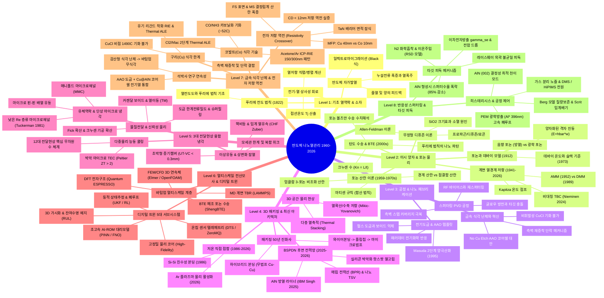

# [[반도체_나노열관리_마인드맵_총괄_지식지도]]

## 📌 Brief Summary
본 문서는 1960년대 고체 물리 및 반도체 패키징의 태동기부터 2026년 최첨단 하이브리드 본딩 및 BSPDN 나노열관리에 이르는 전 영역을 **원자적 지식 노드(Atomic Notes)로 분해·연결한 마인드맵 총괄 지식 지도(Mindmap Master Index)**입니다. 가장 쉬운 직관적 기초 개념부터 최고난도 미시 포논 수송 물리, 그리고 실증 공정 및 논문군까지 일목요연하게 탐색할 수 있습니다.

---

## 🗺️ 1. 1960~2026 반도체 열관리 마인드맵 (Mermaid Mindmap)

---

## 🗂️ 2. 지식 노드 아카이브 목차 (양산된 원자적 마크다운 링크)

> **💡 전체 7대 학문 클러스터별 상세 분류 및 상호 연결 브릿지 맵**: [[반도체_나노열관리_전체_지식노트_주제별_연계_클러스터_총람 (Knowledge Concept Clusters)]]

### [기초 직관 & 소자 열역학]
- [[열전도도와 푸리에 법칙 기초 (Thermal Conductivity & Fourier Law)]]: 비열, 전도 메커니즘, 200년 거시 열전달의 기본 수식.
- [[전기-열 상사성과 열저항 회로 (Thermal Resistance Network)]]: 옴의 법칙 대응, 1D 직렬/병렬 등가망, 접션 온도 계산.
- [[반도체 자가발열과 열폭주 메커니즘 (Self-Heating & Thermal Runaway)]]: Joule heating, 누설전류 폭증 피드백, 전자 이동도 저하 및 EM 수명.

### [미시 양자 포논 & 계면 물리]
- [[포논의 개념과 데바이 모델 (Phonon & Debye Model)]]: 격자 진동 양자화, 음향 vs 광학 포논, 데바이 온도.
- [[포논 산란 기작의 역사와 마티센 규칙 (Phonon Scattering Mechanisms)]]: Callaway/Holland 모델, Umklapp 산란, 1973 Slack 고열전도 판정 기준.
- [[크누센 수와 탄도 열수송 (Knudsen Number & Ballistic Transport)]]: $\mathrm{Kn} = \Lambda / L$, 확산-준탄도-탄도 3대 영역, 푸리에 파탄 원인.
- [[포논 볼츠만 수송 방정식 (BTE)]]: RTA 근사, 나노박막 두께별 $k(t)$ 크기 효과, 수치해석 프레임워크.
- [[계면 열경계 저항과 AMM DMM 역사 (History of TBR AMM DMM)]]: 1941 Kapitza부터 1989 Swartz DMM, 2024 Nieminen 비대칭 TBC까지의 80년 역사.
- [[카피차 저항 및 계면 열전도도 (Kapitza Resistance & TBC)]]: 계면 온도 점프, 나노박막 계면 지배 현상.
- [[Wurtzite AlN 결정성 및 포논 수송 메커니즘]]: (002) 주상정 배향, 열전도 이방성, 산소 불순물 산란.
- [[무정형 SiO2 디퓨존 이론 (Diffuson & Locon)]]: Allen-Feldman 무정형 진동 이론, a-SiO₂ 크기효과 소멸, 25.2배 열저항 폭증 원인.

### [제조 공정 & 물리화학]
- [[스퍼터링 PVD 공정의 기본 원리와 플라즈마 (Sputtering & Plasma Basics)]]: 탄성 충돌, RF 마그네트론, 기판 바이어스 재스퍼터링.
- [[전기도금과 AAO 나노템플릿 공정 원리 (Electroplating & AAO Templates)]]: 패러데이 법칙, 펄스 도금 보이드 억제, Masuda 2단계 양극산화.
- [[비휘발성 금속 식각과 재증착 제어 (Non-volatile Metal Etching & Redeposition)]]: CuCl 비휘발성 난제, 측벽 재증착 단락, No Cu Etch 대안.
- [[저온 직접 접합 및 플라즈마 표면 활성화]]: 3단계 직접 접합 기작, Ar vs O₂ 플라즈마, 표면 조도 임계값 ($R_q < 1.0\,\text{nm}$).
- [[반도체 직접 접합과 표면 활성화 연대기 (Direct Bonding History 1986-2026)]]: 1986 Shimbo Si 본딩부터 2026 Huang AlN 본딩까지.

### [3D 패키징 & 시스템 응용]
- [[3D 적층 패키징의 진화: 와이어본딩부터 하이브리드 본딩까지 (Packaging Evolution)]]: 50년 인터커넥트 세대별 대조표, 하이브리드 본딩의 이점과 방열 과제.
- [[열확산 저항 (Spreading Resistance)]]: 3D 공간 유선 집중, Mikic-Yovanovich 수식, 피치 독립성 오류 극복.
- [[BSPDN 후면 전력공급망 열관리 아키텍처]]: 매립 전력선(BPR), 나노 TSV, 실리콘 박막화 핫스팟 열고립, AlN 라이너 방열 효과.
- [[반도체_공정_머신러닝_종류_적용방법_및_데이터규모별_학습이론_총람]]: 단위 공정별 ML 적용 맵 및 데이터 규모별(극소규모~빅데이터, 오프라인 강화학습) 학습 이론 총람.
- [[Paper_Draft_v6_Final_Submission]]: AAO 기반 Cu@AlN 코어-쉘 나노구조 인터커넥트 최종 투고 논문 원고.
- [[대학연구실규모_반도체열관리_연구주제선별_및_지식계층사다리]]: 대학 랩스케일 가능 연구 4선 및 지식 사다리.

### [3대 전달현상: 유체역학 · 열전달 · 물질전달 융합 냉각]
- [[반도체_열관리_3대_전달현상_물리개념_및_수식_총람]]: 유체역학·열전달·물질전달 전 영역 마스터 마인드맵 및 단위공정·냉각 매트릭스.
- [[반도체 전달현상 핵심 무차원수 총람 (Dimensionless Numbers in Semiconductor Cooling)]]: $Re, Pr, Nu, Kn, Bo, Ca, We, Ja, Sc, Sh, Bi$ 등 12대 무차원수 수학적 정의 및 마이크로/나노 스케일 물리 해석.
- [[전달현상 지배방정식과 나비에-스톡스-에너지-연속 방정식 (Navier-Stokes & Energy Equation)]]: 질량·운동량·에너지·물질 보존식, 텐서 표기, 켤레 열전달(CHT) 연속성 경계조건 및 FEM/CFD 모델링 가이드.
- [[미세유체역학 및 반도체 마이크로채널 냉각 (Microfluidics & On-Chip Microchannels)]]: 층류 마이크로채널, Hagen-Poiseuille 압력강하, $R_{tot}$ 분해, 매니폴드(MMC) 및 핀-핀 아키텍처.
- [[상변화 열전달과 증기챔버 및 비등 냉각 (Two-Phase Heat Transfer, Vapor Chamber & Boiling)]]: 잠열 이상유동, Nukiyama 비등 곡선, Zuber CHF 한계, 초박형 증기챔버(UT-VC) 모세관 작동 한계 4선.
- [[계면 물질전달과 박막 증착 및 전기도금 확산 (Mass Transfer, Thin Film Deposition & Electroplating Diffusion)]]: 픽의 확산, 크누센 기공 확산, 전기도금 한계전류밀도($i_{lim}$), 커켄달 보이드, 전자기이동(EM) 및 열이동(TM / Soret Effect).
- [[열전 효과와 칩스케일 능동 펠티어 냉각 (Thermoelectric Effect & On-Chip TEC Cooling)]]: 제벡·펠티어·톰슨 효과, 켈빈 관계식, $ZT$ 성능지수, 핫스팟 제거용 온칩 박막 마이크로 TEC 연성 설계.

### [멀티스케일 전산모사 & 디지털 트윈]
- [[반도체_열관리_및_공정_전체_시뮬레이션_포트폴리오_총람 (All Simulation Portfolio)]]: 적용 가능한 모든 시뮬레이션 포트폴리오 및 PC1/PC2 하드웨어 도약 총람.
- [[PC1_및_PC2_하드웨어_클러스터_시뮬레이션_배치_및_스웜_실행_로드맵]]: 노트북-PC1(4070Ti)-PC2(Dual 4090) 3단계 클러스터 역할분담 및 실행 명령어.
- [[제1원리_DFT_전자구조_및_포논_시뮬레이션_가이드 (DFT & Phonon QE VASP)]]: Quantum ESPRESSO 및 Phonopy 포논 분산 시뮬레이션.
- [[분자동역학_MD_계면_TBR_및_머신러닝포텐셜_시뮬레이션 (LAMMPS & DeepMD)]]: LAMMPS Kokkos GPU 가속 및 DeepMD 머신러닝 포텐셜.
- [[포논_BTE_및_메조스케일_열수송_몬테카를로_시뮬레이션 (ShengBTE & OpenBTE)]]: ShengBTE/OpenBTE 나노박막 두께별 $k(t)$ 모델링.
- [[연속체_3D_FEM_열응력_및_CFD_미세유체_시뮬레이션 (Elmer FEM & OpenFOAM)]]: Elmer FEM 3D 열응력 및 OpenFOAM CHT/VOF 해석.
- [[플라즈마_화학_스퍼터링_PVD_및_식각_공정_시뮬레이션 (PIC-MCC, kMC & TCAD)]]: PIC-MCC 플라즈마, DSMC 스퍼터 가스, kMC 형상진화.
- [[반도체_열관리_멀티스케일_시뮬레이션_및_디지털트윈_통합_총람]]: 멀티스케일 연계 아키텍처 및 디지털 트윈 5대 핵심 요소 마스터 총람.
- [[멀티스케일 전산모사 기법 총람 (DFT, MD, BTE, FEM, CFD)]]: DFT, MD(LAMMPS), BTE(ShengBTE), FEM(Elmer), CFD(OpenFOAM)의 스케일별 기법 및 데이터 핸드셰이크.
- [[반도체 열관리 디지털 트윈 5대 핵심 아키텍처 및 구현 기술]]: 물리모델-대리모델-센서-상태추정-폐루프제어 풀스택 아키텍처 및 소프트웨어 스택.
- [[물리기반 차수축소모델(ROM)과 PINN 및 서스테인 AI 서베이]]: POD-Galerkin, PINN, FNO, GPR 대리 모델링 수학적 원리, 추론 속도($< 1\,\text{ms}$) 및 정량 비교.
- [[동적 전력-열 관리(DTPM)와 폐루프 제어 및 잔여수명(RUL) 예측]]: 무향 칼만 필터(UKF) 3D 온도 복원, Offline RL 폐루프 제어, Coffin-Manson/EM 실시간 잔여수명(RUL) 예지 알고리즘.

### [금속 식각(Cu/Co) & 나노스케일 저항역전]
- [[석박사_연구연계_로드맵_식각난제에서_무식각_CuAlN_하이브리드본딩까지]]: 석사(Cu/Co 건식 식각) $\to$ 박사(Cu@AlN 코어쉘 무식각 하이브리드 본딩) 학문적 연계 및 패러다임 전환 총괄.
- [[구리_식각_연구_논문_및_화학반응_총람 (Cu Dry Etch & ALE Literature)]]: Cu RIE, CuCl 비휘발성 난제, 유기 리간드 착화(Hfac/Acac) 및 Thermal ALE 문헌 총람.
- [[코발트_식각_연구_논문_및_카보닐화_메커니즘 (Co Dry Etch & Carbonyl Literature)]]: Co 건식 식각, CO/NH3 카보닐화, 아세톤 ICP-RIE, 150/300nm 패턴 실증 문헌 총람.
- [[전자_평균자유행로_미만_금속배선_저항_역전현상_분석 (Resistivity Crossover)]]: Cu(40nm) vs Co(10nm) 전자 MFP, FS/MS 크기효과, TaN 배리어 잠식 및 sub-12nm 저항 역전 수학적·실험적 실증.

### [반응성 스퍼터링 & 타깃 피독]
- [[반응성_스퍼터링과_타깃_피독_메커니즘_및_논문_총람 (Reactive Sputtering & Target Poisoning)]]: 반응성 스퍼터링 비선형 히스테리시스, Berg 모델 및 고전/최신(Berg, Depla, Vaziri 2025) 문헌 총람.
- [[타깃_피독_물리화학_메커니즘_및_재료_영향_분석 (Target Poisoning Physics)]]: 원자 흡착/주입, 결합에너지($U_0$)와 스퍼터수율 폭락, $\gamma_{se}$ 변동 및 레이스웨이 불균일 물리.
- [[반응성_스퍼터링_공정제어_및_히스테리시스_극복_기술 (Reactive Sputtering Process Control)]]: $S_{crit}$ 임계배기속도, PEM 광학 피드백 제어, 가스분리 노즐, DMS/HiPIMS 전원 기술.

---
*Last updated: 2026-10-07*

