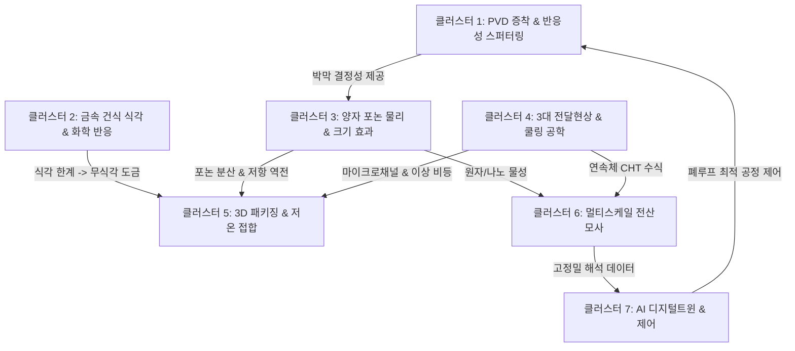

# [[반도체_나노열관리_전체_지식노트_주제별_연계_클러스터_총람 (Knowledge Concept Clusters)]]

## 📌 Brief Summary
본 문서는 연구 보관함 내에 구축된 60여 편의 전문 마크다운 지식 노트를 학문적 성격과 물리적 스케일에 따라 **7대 핵심 지식 클러스터(7 Core Knowledge Clusters)**로 체계적으로 분류하고, 개별 개념 노트 간의 **상호 인과관계, 교차 참조(Cross-Linking) 경로, 연구 연계 브릿지(Research Nexus Bridges)**를 집대성한 지식 네트워크 총람 카탈로그입니다.

---

## 🗺️ 1. 7대 핵심 지식 클러스터 분류 구조도 (Mermaid)

---

## 🗂️ 2. 7대 지식 클러스터별 세부 마크다운 노트 분류 및 연결 맵

### [클러스터 1] 박막 PVD 증착 & 반응성 스퍼터링 플라즈마 공정 (Thin Film PVD & Plasma Processing)
> **핵심 테마**: 고품질 나노 박막(AlN, 금속) 증착 시 플라즈마-타깃-표면 반응 제어 및 결정 배향성 극대화.

- 📘 [[반응성_스퍼터링과_타깃_피독_메커니즘_및_논문_총람 (Reactive Sputtering & Target Poisoning)]] : 반응성 스퍼터링 히스테리시스 및 고전/최신(Berg, Depla, Vaziri 2025) 문헌 총람
- 🔬 [[타깃_피독_물리화학_메커니즘_및_재료_영향_분석 (Target Poisoning Physics)]] : 원자 흡착/주입, 결합에너지($U_0$)와 스퍼터수율 폭락, $\gamma_{se}$ 변동 및 레이스웨이 불균일 물리
- ⚙️ [[반응성_스퍼터링_공정제어_및_히스테리시스_극복_기술 (Reactive Sputtering Process Control)]] : $S_{crit}$ 임계배기속도, PEM 광학 피드백 제어, 가스분리 노즐, DMS/HiPIMS 전원 기술
- 📜 [[스퍼터링 PVD 공정의 기본 원리와 플라즈마 (Sputtering & Plasma Basics)]] : 글로우 방전, 마그네트론 이온 구속, RF 바이어스 재스퍼터링 원리
- 📋 [[3단계_신규테마_AlN_표면전달성_및_저온본딩_연구설계서]] : AlN 스퍼터링 DOE 직교배열 및 표면 조도($R_q < 0.5\,\text{nm}$) 공정창

---

### [클러스터 2] 금속 건식 식각 & 화학 반응 공학 (Metal Dry Etch & Reactive Chemistry)
> **핵심 테마**: 비휘발성 전이금속(Cu, Co)의 패터닝 한계, 재증착 결함 극복, 유기 리간드 착화 및 Thermal ALE.

- 📜 [[구리_식각_연구_논문_및_화학반응_총람 (Cu Dry Etch & ALE Literature)]] : $\text{CuCl}$ 비점 $1,490^\circ\text{C}$ 난제, 고온 RIE, 알코올/아세트산 플라즈마, Hfac 착화 Thermal ALE 문헌 총람
- ⚡ [[코발트_식각_연구_논문_및_카보닐화_메커니즘 (Co Dry Etch & Carbonyl Literature)]] : $\text{CO}/\text{NH}_3$ 카보닐화 기화, 아세톤/Ar RIE 150/300nm 패턴 실증, $\text{Cl}_2/\text{hfac}$ ALE 문헌 총람
- ⚠️ [[비휘발성 금속 식각과 재증착 제어 (Non-volatile Metal Etching & Redeposition)]] : 측벽 재증착 단락 메커니즘 및 감산형 가공 한계
- 🌉 [[석박사_연구연계_로드맵_식각난제에서_무식각_CuAlN_하이브리드본딩까지]] : 석사 식각 난제 연구에서 박사 바텀업 무식각(No-Etch) 도금으로의 패러다임 전환

---

### [클러스터 3] 양자 나노 물리, 전자/포논 수송 & 크기 효과 (Quantum Nanophysics & Transport)
> **핵심 테마**: 평균자유행로(MFP) 미만 나노 스케일에서 발생하는 전자 저항 역전 및 포논 산란 물리학.

- 📉 [[전자_평균자유행로_미만_금속배선_저항_역전현상_분석 (Resistivity Crossover)]] : Cu(40nm) vs Co(10nm) 전자 MFP, FS/MS 산란, TaN 배리어 잠식 및 sub-12nm 저항 역전 실증
- ⚛️ [[포논의 개념과 데바이 모델 (Phonon & Debye Model)]] : 격자 진동 양자화, 음향 포논 분산, 데바이 비열 및 Slack 고열전도도 기준
- 🛡️ [[포논 산란 기작의 역사와 마티센 규칙 (Phonon Scattering Mechanisms)]] : Umklapp 산란, 점결함 산란, 경계 산란 및 Callaway 모델
- 📏 [[크누센 수와 탄도 열수송 (Knudsen Number & Ballistic Transport)]] : $Kn = \Lambda/L$, 탄도 포논 수송 및 푸리에 법칙 파탄 메커니즘
- 🧩 [[포논 볼츠만 수송 방정식 (BTE)]] : RTA 근사 기반 BTE 수치해석 및 박막 두께별 열전도도 $k(t)$ 크기 효과
- 🚪 [[계면 열경계 저항과 AMM DMM 역사 (History of TBR AMM DMM)]] : 1941 Kapitza부터 1989 Swartz DMM, 2024 Nieminen 비대칭 TBC까지의 80년 역사
- 🌡️ [[카피차 저항 및 계면 열전도도 (Kapitza Resistance & TBC)]] : 접합 계면 온도 불연속($\Delta T$), TBR 및 TBC의 나노스케일 지배성
- 💎 [[Wurtzite AlN 결정성 및 포논 수송 메커니즘]] : (002) c-축 주상정 배향, 열전도 이방성, 산소 불순물 산란
- 🌫️ [[무정형 SiO2 디퓨존 이론 (Diffuson & Locon)]] : Allen-Feldman 무정형 진동 이론, a-SiO₂ 크기효과 소멸 및 25.2배 열저항 폭증 원인

---

### [클러스터 4] 3대 전달현상 (유체·열·물질) 및 냉각 공학 (Fluid, Thermal & Mass Transport)
> **핵심 테마**: 반도체 칩에서 발생하는 극한 열유속을 제거하기 위한 미세유체, 이상 비등 및 전기화학 물질수송.

- 📘 [[반도체_열관리_3대_전달현상_물리개념_및_수식_총람]] : 유체·열·물질전달 전 영역 통합 마스터 마인드맵 및 매트릭스
- 📐 [[반도체 전달현상 핵심 무차원수 총람 (Dimensionless Numbers in Semiconductor Cooling)]] : $Re, Pr, Nu, Kn, Bo, Ca, We, Ja, Sc, Sh, Bi$ 12대 무차원수 체계
- ⚖️ [[전달현상 지배방정식과 나비에-스톡스-에너지-연속 방정식 (Navier-Stokes & Energy Equation)]] : 질량·운동량·에너지 보존식 및 켤레 열전달(CHT) 경계조건
- 💧 [[미세유체역학 및 반도체 마이크로채널 냉각 (Microfluidics & On-Chip Microchannels)]] : 층류 Hagen-Poiseuille 압력강하, $R_{tot}$ 분해, 온칩 매니폴드(MMC) 쿨링
- ♨️ [[상변화 열전달과 증기챔버 및 비등 냉각 (Two-Phase Heat Transfer, Vapor Chamber & Boiling)]] : 잠열 이상유동, Nukiyama 비등 곡선, Zuber CHF 한계, 초박형 증기챔버(UT-VC)
- 🧪 [[계면 물질전달과 박막 증착 및 전기도금 확산 (Mass Transfer, Thin Film Deposition & Electroplating Diffusion)]] : Fick 확산, 한계전류밀도, 커켄달 보이드, 전자기이동(EM) 및 열이동(TM)
- ⚡ [[열전 효과와 칩스케일 능동 펠티어 냉각 (Thermoelectric Effect & On-Chip TEC Cooling)]] : 펠티어/제벡 효과, $ZT$ 성능지수, 핫스팟 제거용 온칩 박막 마이크로 TEC
- 🔥 [[열전도도와 푸리에 법칙 기초 (Thermal Conductivity & Fourier Law)]] : 거시 열전도 기초
- 🔌 [[전기-열 상사성과 열저항 회로 (Thermal Resistance Network)]] : 1D/3D 열저항 등가망 모델링
- 🌐 [[열확산 저항 (Spreading Resistance)]] : 국소 핫스팟 유선 집중 및 Mikic-Yovanovich 수식

---

### [클러스터 5] 3D 패키징, 접합 공정 & 인터커넥트 (3D Packaging, Bonding & Interconnects)
> **핵심 테마**: 차세대 3D 하이브리드 본딩, 이종 집적, 바텀업 나노템플릿 공정 및 후면 전력망 아키텍처.

- 🏆 [[Paper_Draft_v6_Final_Submission]] : Cu@AlN 코어-쉘 나노구조 인터커넥트 최종 투고 논문 원고 (박사 연구 핵심 집대성)
- 🏗️ [[3D 적층 패키징의 진화: 와이어본딩부터 하이브리드 본딩까지 (Packaging Evolution)]] : 50년 인터커넥트 세대별 진화 및 하이브리드 본딩 열 과제
- 🧪 [[전기도금과 AAO 나노템플릿 공정 원리 (Electroplating & AAO Templates)]] : Masuda 2단계 양극산화 및 무결함 펄스 구리 도금 바텀업 성장
- 🤝 [[저온 직접 접합 및 플라즈마 표면 활성화]] : 3단계 직접 접합 기작, Ar 플라즈마 물리 활성화, 표면 조도 임계값 ($R_q < 1.0\,\text{nm}$)
- 📜 [[반도체 직접 접합과 표면 활성화 연대기 (Direct Bonding History 1986-2026)]] : 1986 Shimbo Si 본딩부터 2026 Huang AlN 본딩까지의 역사
- ⚡ [[BSPDN 후면 전력공급망 열관리 아키텍처]] : 매립 전력선(BPR), 나노 TSV, 실리콘 박막화 핫스팟 열고립 및 AlN 라이너 방열 효과
- 🚨 [[반도체 자가발열과 열폭주 메커니즘 (Self-Heating & Thermal Runaway)]] : 줄열, 누설전류 폭증, 열폭주 파괴 메커니즘

---

### [클러스터 6] 멀티스케일 전산모사 기법 (Multiscale Computational Modeling)
> **핵심 테마**: 원자 스케일부터 매크로 시스템까지 스케일별 지배 방정식 수치해석 및 파라미터 핸드셰이크.

- 🌐 [[반도체_열관리_및_공정_전체_시뮬레이션_포트폴리오_총람 (All Simulation Portfolio)]] : 적용 가능한 모든 시뮬레이션 포트폴리오 및 PC1/PC2 하드웨어 도약 총람
- 💻 [[PC1_및_PC2_하드웨어_클러스터_시뮬레이션_배치_및_스웜_실행_로드맵]] : 노트북-PC1(4070Ti)-PC2(Dual 4090) 3단계 클러스터 역할분담 및 실행 명령어
- ⚛️ [[제1원리_DFT_전자구조_및_포논_시뮬레이션_가이드 (DFT & Phonon QE VASP)]] : Quantum ESPRESSO 및 Phonopy 포논 분산 시뮬레이션
- 🧪 [[분자동역학_MD_계면_TBR_및_머신러닝포텐셜_시뮬레이션 (LAMMPS & DeepMD)]] : LAMMPS Kokkos GPU 가속 및 DeepMD 머신러닝 포텐셜
- 📏 [[포논_BTE_및_메조스케일_열수송_몬테카를로_시뮬레이션 (ShengBTE & OpenBTE)]] : ShengBTE/OpenBTE 나노박막 두께별 $k(t)$ 모델링
- 🏛️ [[연속체_3D_FEM_열응력_및_CFD_미세유체_시뮬레이션 (Elmer FEM & OpenFOAM)]] : Elmer FEM 3D 열응력 및 OpenFOAM CHT/VOF 해석
- 🌪️ [[플라즈마_화학_스퍼터링_PVD_및_식각_공정_시뮬레이션 (PIC-MCC, kMC & TCAD)]] : PIC-MCC 플라즈마, DSMC 스퍼터 가스, kMC 형상진화
- 🌐 [[반도체_열관리_멀티스케일_시뮬레이션_및_디지털트윈_통합_총람]] : 멀티스케일 전산모사 및 디지털트윈 연계 마스터 아키텍처
- 🔬 [[멀티스케일 전산모사 기법 총람 (DFT, MD, BTE, FEM, CFD)]] : DFT(Quantum ESPRESSO), MD(LAMMPS), BTE(ShengBTE), FEM(Elmer), CFD(OpenFOAM) 데이터 핸드셰이크
- ⚙️ [[2단계_PC1_스웜데몬_런치_및_실행가이드]] : PC1 분산 병렬 연산(WSL Quantum ESPRESSO + Elmer FEM) 스웜 데몬 가이드
- 🗺️ [[통합_연구_마스터플랜_멀티스케일_반도체_열관리]] : Atoms-to-Systems 멀티스케일 종합 연구 로드맵

---

### [클러스터 7] 인공지능, 디지털 트윈 & 폐루프 제어 (AI, Digital Twin & Closed-Loop Control)
> **핵심 테마**: 실시간 1ms 내 물리 예측, 동적 전력/냉각 제어, 센서 융합 및 신뢰성 잔여 수명(RUL) 예지.

- 🤖 [[반도체_공정_머신러닝_종류_적용방법_및_데이터규모별_학습이론_총람]] : 단위 공정별 ML 적용 맵 및 데이터 규모별(GPR, PINN, Offline RL) 학습 이론 총람
- 🏛️ [[반도체 열관리 디지털 트윈 5대 핵심 아키텍처 및 구현 기술]] : 물리엔진-대리모델-센서-폐루프제어-가시화 풀스택 아키텍처
- ⚡ [[물리기반 차수축소모델(ROM)과 PINN 및 서스테인 AI 서베이]] : POD-Galerkin, PINN, FNO, GPR 대리 모델링 수학적 원리 및 정량 비교
- 🛡️ [[동적 전력-열 관리(DTPM)와 폐루프 제어 및 잔여수명(RUL) 예측]] : UKF 상태추정, Offline RL 폐루프 제어, Coffin-Manson/EM 실시간 잔여수명 진단

---

## 🌉 3. 클러스터 간 교차 연구 브릿지 (Cross-Cluster Bridges)

| 교차 브릿지 | 출발 클러스터 $\to$ 도착 클러스터 | 학문적·기술적 연결 메커니즘 |
| :--- | :--- | :--- |
| **브릿지 A** | [클러스터 1: PVD 스퍼터] $\to$ [클러스터 3: 포논 물리] | 반응성 스퍼터링 공정창(천이 모드) 최적화로 성장된 AlN의 (002) 결정성이 포논 경계산란 및 $k_{eff}$를 결정함. |
| **브릿지 B** | [클러스터 2: 식각 난제] $\to$ [클러스터 5: 3D 패키징] | 비휘발성 $\text{CuCl}$ 재증착 난제를 회피하기 위해, AAO 템플릿 바텀업 도금과 Cu@AlN 무식각 코어쉘로 공정 전환. |
| **브릿지 C** | [클러스터 3: 양자 물리] $\to$ [클러스터 5: 3D 패키징] | 전자 MFP($\lambda$) 축소에 따른 sub-12nm 저항 역전 및 TBR 지배 현상을 극복하기 위해 AlN 초박형 쉘 및 저온 본딩 설계. |
| **브릿지 D** | [클러스터 3, 4: 물리학] $\to$ [클러스터 6: 시뮬레이션] | 포논 BTE 및 유체 CHT 지배방정식이 각각 ShengBTE와 Elmer FEM/OpenFOAM의 솔버 알고리즘으로 구현됨. |
| **브릿지 E** | [클러스터 6: 시뮬레이션] $\to$ [클러스터 7: 디지털 트윈] | 수 시간이 걸리는 3D 유한요소 해석 결과를 POD/PINN으로 차수 축소하여 실시간 $1\,\text{ms}$ 폐루프 제어 트윈 모델 구축. |

---

## 🔗 Knowledge Connections
- [[환영합니다!.md]] : 연구 보관함 최상위 대시보드
- [[반도체_나노열관리_마인드맵_총괄_지식지도]] : 전체 1960~2026 연대기 및 마인드맵
- [[대학연구실규모_반도체열관리_연구주제선별_및_지식계층사다리]] : 4대 연구주제 선별 및 지식 사다리

*Last updated: 2026-10-07*
