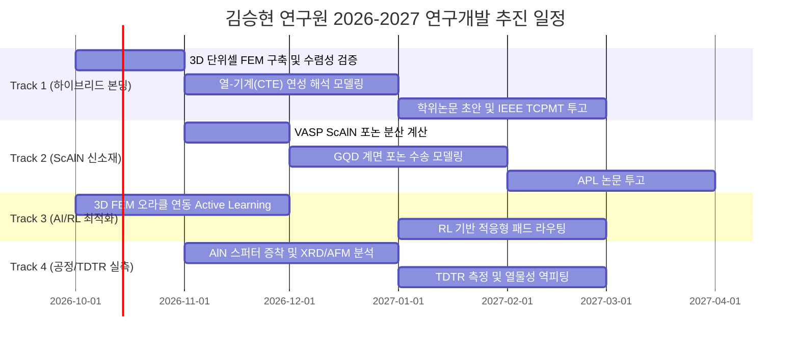

# [[통합_연구_마스터플랜_멀티스케일_반도체_열관리]]

## 📌 Brief Summary
본 계획서는 김승현 연구원님의 6대 핵심 연구 폴더(`SH`, `RR`, `Reference2`, `Reference`, `Total`, `Side papers`)에 축적된 250여 편의 최상위 학술 문헌, VASP 제1원리 계산 자산, AlN 공정 노트, 그리고 디지털 트윈/패키징 자료를 종합 분석하여 수립한 **"Atoms-to-Systems" 멀티스케일 반도체 방열 연구 마스터플랜**입니다.

---

## 🧭 1. 6대 연구 폴더 지식 자산 분석 (Knowledge Asset Audit)

```
[원자/격자 스케일 (DFT)]           [나노/계면 스케일 (MD/BTE)]          [패키지/소자 스케일 (FEM/AI)]
  SH/Vasppacks (VASP, Phonon)   ↔   Reference/Methodogy (Tersoff, SW)  ↔   SH/2025/Thermal management (Progress/Lab)
  Total (ScAlN, 신소재 격자)        Reference/Reference2 (포논 BTE)        SH/2502 (AlN 증착 & Digital Twin)
                                    RR/Side papers (TDTR, 계면 TBC)        Side papers (ECTC, ACM TODAES)
```

| 폴더명 | 주요 보유 자식 및 핵심 자산 | 연구에서의 포지셔닝 및 의미 |
| :--- | :--- | :--- |
| **`SH/`** | - **VASP 계산 패키지 (`Vasppacks/`):** `INCAR`, `KPOINTS`, `VaspGibbs.md` (포논 진동 주파수 `IBRION=5`, 깁스 자유에너지 연산 파이프라인)<br>- **공정 및 프로젝트 노트 (`2412/`, `2502/`):** AlN 박막 증착(Sputter/ALD) 공정 노트, 반도체 열관리 디지털 트윈(Digital Twin) 기획서<br>- **진도보고 및 랩미팅 (`2025/`):** 다층 패키징 발열 분석, CPU-GPU/Macro/Microscale 문헌 리뷰 PPT<br>- **비밀/신소재 자료 (`Secrets/`):** 그래핀 양자점(GQD) 방열 소재 및 피규어 플랜 | **연구의 컨트롤 타워.** 연구원님의 실제 연구 이력, 공정 노하우, 제1원리 계산 데이터가 집약된 핵심 허브. |
| **`Reference/`** | - **최신 리뷰 및 패키징 거두 논문 (70편):** Nature Rev. Elec. (2025), John Lau 교수의 Chiplet/3D IC 패키징, IEDM/ISSCC 논문<br>- **분자동역학 방법론 (`Methodogy/`):** Stillinger-Weber(SW) 및 Tersoff 경험적 원자 포텐셜 논문 | 첨단 3D 적층 패키징 트렌드와 원자간 포텐셜 모델링의 기반 이론 라이브러리. |
| **`Reference2/`** | - **고체물리 및 나노 열전달 기초 (61편):** *Rev. Mod. Phys.* (포논 수송 리뷰), *Phys. Rev. B* (격자 열전도도, 카피차 저항), IEEE ECTC 학회논문 | 학부/대학원 마이크로스케일 열전달의 수식적 엄밀성과 포논 산란 기작의 이론적 뼈대. |
| **`RR/`** | - **방대한 열수송/반도체 레퍼런스 (157편):** 박막 열물성 측정(TDTR, 3-omega), 와이드밴드갭(AlN, SiC, Ga₂O₃, Diamond) 소재 논문 | 세계적 연구 그룹들의 실험 측정치 및 계면 열전도도(TBC/ITC) 실측 벤치마크 데이터베이스. |
| **`Total/`** | - **차세대 질화물 신소재 (14편):** 강유전체/압전 $\text{Al}_{1-x}\text{Sc}_x\text{N}$ (ScAlN) 트랜지스터, *Nano-Micro Lett.*, *Appl. Phys. Rev.*, *Small* (2024~2025 최신작) | 단순 방열을 넘어 차세대 지능형 반도체 소자(RF/메모리/전력)로 확장 가능한 미래 신소재 풀. |
| **`Side papers/`** | - **패키징 신뢰성 및 전자설계자동화 (12편):** *ACM TODAES* (칩 열해석 EDA), *Microelectronics Reliability* (하이브리드 본딩 신뢰성), *ACS AMI* | 수치해석 결과를 실제 상용 반도체 설계 자동화 및 신뢰성 평가 툴로 연결하는 응용 논문군. |

---

## 🏛️ 2. "Atoms-to-Systems" 통합 연구 프레임워크

보유하신 자산은 원자 수준의 전자/포논 계산부터 완성형 3D 패키지 시스템까지 수직 계열화되어 있습니다. 이를 4단계 멀티스케일 계층으로 정립합니다:

```
[Level 1: 원자/격자 스케일]  ──►  VASP DFT 기반 포논 분산, 비조화(Anharmonic) 산란율, 음향 속도 계산
          │
[Level 2: 나노/계면 스케일]  ──►  MD(Tersoff/SW) & 포논 BTE 기반 Si-AlN / Cu-AlN 계면 TBC 및 두께별 k(t) 도출
          │
[Level 3: 소자/패키지 스케일] ──►  Elmer/Gmsh 3D 단위셀 해석, 24층 하이브리드 본딩 핫스팟 열-기계(CTE) 연성 해석
          │
[Level 4: 시스템/AI 스케일]   ──►  Active Learning 대리모델 & 강화학습(RL) 기반 지능형 방열 디지털 트윈 구축
```

---

## 🚀 3. 향후 추진 가능한 4대 핵심 프로젝트 트랙

### 🎯 Track 1: [학위논문 / Main Track] 3D 하이브리드 본딩용 초박막 AlN의 열-기계 연성 디지털 트윈
- **배경:** `SH/2502`의 디지털 트윈 기획과 `Reserach1`의 24층 본딩 열축적 연구를 통합.
- **연구 목표:** Cu-AlN 하이브리드 본딩 공정에서 발생하는 **"열확산 이득 vs 열팽창 불일치 응력"**의 상충 관계를 완벽히 예측하는 디지털 트윈 완성.
- **핵심 마일스톤:**
  1. **3D 단위셀 열-응력 연성 해석:** 본딩 어닐링($300^\circ\text{C} \to 25^\circ\text{C}$) 시 $\text{Cu}-\text{AlN}-\text{Si}$ 경계면의 잔류 응력 및 휨(Warpage) 해석.
  2. **디지털 트윈 대리모델 탑재:** GP 능동학습 엔진(`train_thermal.py`)을 3D FEM과 결합하여 실시간 온도/응력 맵 예측 GUI/API 개발.
  3. **목표 산출물:** 석·박사 학위 논문 핵심 챕터, *IEEE Transactions on Components, Packaging and Manufacturing Technology (TCPMT)* 또는 *IEEE TED* 주저자 논문 1편.

---

### 🎯 Track 2: [신소재 프론티어] 차세대 강유전체 ScAlN 및 GQD 기반 초고열전도 계면 엔지니어링
- **배경:** `Total/`의 ScAlN 최신 논문과 `SH/Secrets/`의 GQD(그래핀 양자점) 소재 자산 결합.
- **연구 목표:** Wurtzite AlN에 Sc(스칸듐) 도핑 시 변화하는 유전율/압전 특성과 포논 산란(열전도도 감소 페널티) 간의 트레이드오프를 제1원리로 규명하고, GQD 계면 삽입을 통한 보완책 제시.
- **핵심 마일스톤:**
  1. **VASP 제1원리 계산 (`SH/Vasppacks` 활용):**
     - $\text{Al}_{1-x}\text{Sc}_x\text{N}$ ($x = 0, 0.125, 0.25, 0.375$) 슈퍼셀 모델링.
     - 포논 분산 곡선 계산 및 음향 포논 군속도(Group Velocity) 변화 추적.
  2. **GQD 계면 삽입 효과:**
     - 이종 접합 계면의 음향 임피던스 불일치(Acoustic Mismatch)를 완화하는 버퍼층으로서의 GQD 가능성 탐색.
  3. **목표 산출물:** *Applied Physics Letters (APL)* 또는 *ACS Applied Materials & Interfaces* 1편.

---

### 🎯 Track 3: [AI & 설계 자동화] 강화학습(RL) 기반 불균일 핫스팟 자율 방열 패드 라우팅
- **배경:** `Side papers/S11 (ACM TODAES)`의 전자설계자동화(EDA)와 옵시디언의 `[[P-Reinforce_Skill]]` 에이전트 결합.
- **연구 목표:** AI 칩(GPU/NPU)의 비대칭적 코어 발열 맵을 입력받아, Cu 패드 직경과 피치를 국소적으로 자동 변형 배치하는 강화학습 알고리즘 개발.
- **핵심 마일스톤:**
  1. **Gymnasium 최적화 환경 구축:** 보상 함수 $R = -(\text{Peak Temp} + \lambda \cdot \text{Stress} + \mu \cdot \text{Cost})$.
  2. **지식 베이스 연동:** 도출된 설계 규칙(Design Rule)을 Obsidian 위키로 자동 구조화하여 지식 자산화.
  3. **목표 산출물:** *IEEE/ACM Design Automation Conference (DAC)* 또는 *ACM TODAES* 논문 1편.

---

### 🎯 Track 4: [실험 측정 연계] Sputter/ALD AlN 공정 박막의 TDTR 실측 및 피팅
- **배경:** `SH/250204 SH Project notes AlN deposition.pptx`의 실제 공정 계획과 `RR/`의 TDTR 문헌 연계.
- **연구 목표:** 연구실 및 한국나노기술원(KANC) 스퍼터 장비로 증착한 $20 \sim 200\,\text{nm}$ AlN 박막 시료의 두께별 실제 열물성 확보.
- **핵심 마일스톤:**
  1. **시료 제작 파라미터화:** 질소 분압, 기판 온도($\text{RT} \sim 400^\circ\text{C}$), RF Power에 따른 결정성($c$축 배향도 XRD) 제어.
  2. **TDTR 피팅:** 측정된 위상(Phase) 데이터를 나노스케일 BTE 열전도 모델과 역해석(Inverse Fitting)하여 진성 $k_{\text{film}}$ 및 계면 $G_1, G_2$ 분리 추출.
  3. **목표 산출물:** 시뮬레이션의 '외삽 가정'을 '실측 검증'으로 전환하여 최상위 저널 게재 확정.

---

## 📅 4. 2026~2027 종합 실행 마일스톤 타임라인



---

## 🗂️ 5. 연구 데이터 정리 및 P-Reinforce 연계 제언

현재 다운로드 폴더에 흩어져 있는 자료들을 체계화하기 위해 `[[P-Reinforce_Skill]]` 기반의 지식 위키 편입을 권장합니다:

1. **PDF 라이브러리 메타데이터화:** `250여 편의 PDF` $\to$ 논문명, 저자, 발표연도, 핵심 TBC 수치 추출 후 `10_Wiki/💡 Topics/`로 자동 요약 노트 생성.
2. **VASP 계산 아카이빙:** `SH/Vasppacks/`의 입·출력 파일 및 스크립트를 Git 리포지토리(`DFTN_VASP_Calculations`)로 버전 관리.
3. **통합 대시보드 (`Index.md`):** 학위논문 진행 상황, 슬라이드 발표 일정, 논문 투고 현황을 한눈에 볼 수 있는 메인 인덱스 구축.

---

## 🔗 Knowledge Connections
- **Related Topics:** [[VASP 제1원리 계산]], [[포논 볼츠만 수송 (BTE)]], [[하이브리드 본딩 디지털 트윈]], [[ScAlN 강유전체]], [[TDTR 열물성 측정]]
- **Projects/Contexts:** [[Reserach1]], [[P-Reinforce_Skill]], [[김승현 연구실 지식 베이스]]
- **Contradictions/Notes:**
  - ScAlN은 강유전성 및 전력소자 특성은 우수하나 Sc 원자의 질량 차이로 인한 합금 산란(Alloy Scattering)으로 인해 순수 AlN 대비 열전도도가 최대 50~70% 급감할 수 있으므로 방열 설계 시 이 페널티를 고려한 열-전기 최적화가 필수적임.

---
*Last updated: 2026-10-07*
